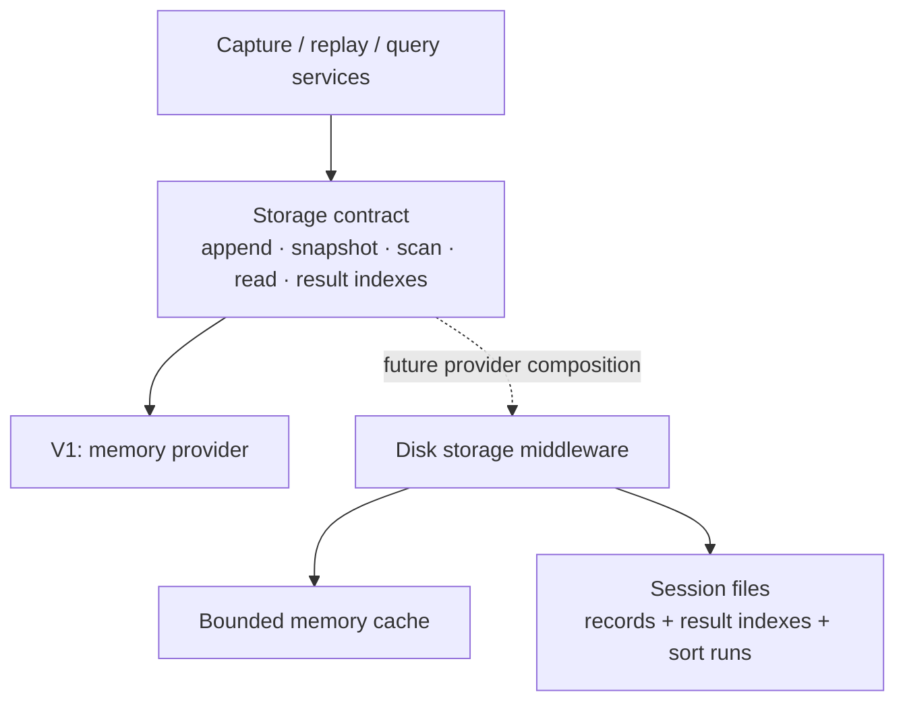

# Architecture

## Implemented scaffold

| Area | Responsibility |
| --- | --- |
| `cmd/streamline` | CLI port, loopback listener, graceful shutdown |
| `internal/httpapi` | `GET /api/v1/health` → `{"status":"ok"}`; unknown API routes return 404 |
| `internal/webassets` | Embedded frontend in release builds; development build excludes assets |
| `web` | Empty Svelte 5 + TypeScript app, Vite, Tailwind 4 |
| UI foundations | shadcn-svelte configuration, Bits UI, neutral theme, class utility |
| Installed for later | TanStack Svelte Virtual and ECharts |

The server uses Go's standard library and builds with CGo disabled.
No ingestion, query engine, storage, profiles, graphs, or SSE are implemented.

## Planned first version

One stdin stream comes from the user's shell, including SSH + tail, journalctl,
or Docker. The full session stays in memory until exit. Memory may grow; there
is no automatic eviction, database, disk spill, or application persistence.
Ten million 1 KB records require roughly 10 GB for raw input, plus parsed data
and query indexes. Bounded queues control processing backlog, not retention.

```mermaid
flowchart LR
  Input["stdin<br/>SSH / tail / journalctl / Docker"] --> Capture["Raw capture"]
  Capture --> Raw["Raw records in RAM"]
  Capture --> Parse["Framing → parsing → profile rules"]
  Parse --> Events["Normalized records in RAM"]
  Raw --> Replay["Profile replay"]
  Replay --> Parse
  Events --> Query["Go query engine<br/>filters / sort / aggregation"]
  Query --> Results["Matching IDs and counts in RAM"]
  Results --> API["Go HTTP + SSE"]
  API -->|"requested rows and chart buckets"| UI["Svelte viewer"]
  UI -->|"query and viewport requests"| API
  API --> Query
```

- Go owns parsing, extraction, filtering, sorting, and graph calculations.
  The browser handles presentation and requests bounded data windows.
- Parse JSON Lines, journal JSON/text, Docker wrappers, and plain text.
  Preserve raw input; normalize ANSI/CRLF for display. Optional explicit
  multiline rules group stack traces.
- Declarative profiles are edited in the UI. Applying a profile replays raw
  records into a new generation and switches atomically after catching up.
- Queries use a shared expression tree for the filter builder and text syntax.
  Batched scans create packed matching-ID indexes; live queries evaluate new
  batches. Other sort orders use a fixed snapshot.
- HTTP JSON carries requests/results; SSE carries small progress/change
  notifications. Responses identify session, generation, query revision, and
  processed-input boundary. Rows and aggregates share a revision.
- The virtualized list renders fixed-height summaries and fetches about 200 rows
  at a time, with a 32 MB page-cache target. Rebase scrolling windows to support
  millions of rows within browser height limits. Details open separately.
- Planned graphs show volume over time and severity/service/container counts.
  Aggregate the entire matching dataset in Go, returning bounded chart data.
- Pausing the view or disconnecting the browser does not stop capture. EOF
  flushes pending records and leaves the viewer running.

Planned Go packages are `ingest`, `parse`, `profile`, `storage/memory`, and
`query` under `internal/`. Add them as their behavior is implemented.

## Later: storage middleware

This is a future extension boundary, not implemented storage code.

Use logical record IDs and opaque snapshot tokens, never expose memory-store
slices to query services. The provider must support:

| Operation | Extension requirement |
| --- | --- |
| Append raw and normalized batches | Publish complete batches with stable IDs and generation boundaries |
| Snapshot and scan | Read a consistent record boundary in batches |
| Read IDs / original input | Serve arbitrary viewport windows, details, and profile replay |
| Create/read result indexes | Let large matching-ID lists and sort runs move out of RAM too |
| Release generations/results | Reclaim resources when investigations are retired |
| Statistics/errors/close | Report capacity and propagate failures through the same API |

A later middleware wraps a bounded memory cache. It intercepts writes and
stores a record before allowing its hot copy to be evicted. Reads check memory
and then disk; scans combine both tiers in logical order without duplicates.
A write-only archive hook would not make older logs searchable.

Preserve snapshots and generation semantics across providers. Storage failures
must not silently discard accepted records. Persisted formats need versioning
if session reopening is added. Select providers through ordinary Go composition
and a startup factory; runtime plugin loading is unnecessary. Run the same
contract tests against memory and future persistent providers.

## References

- [shadcn-svelte](https://www.shadcn-svelte.com/docs)
- [TanStack Svelte Virtual](https://tanstack.com/virtual/latest/docs/framework/svelte/svelte-virtual)
- [Journal export formats](https://systemd.io/JOURNAL_EXPORT_FORMATS/)
