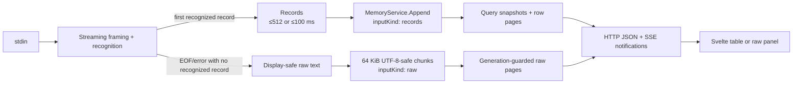
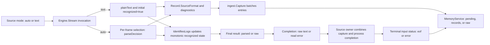
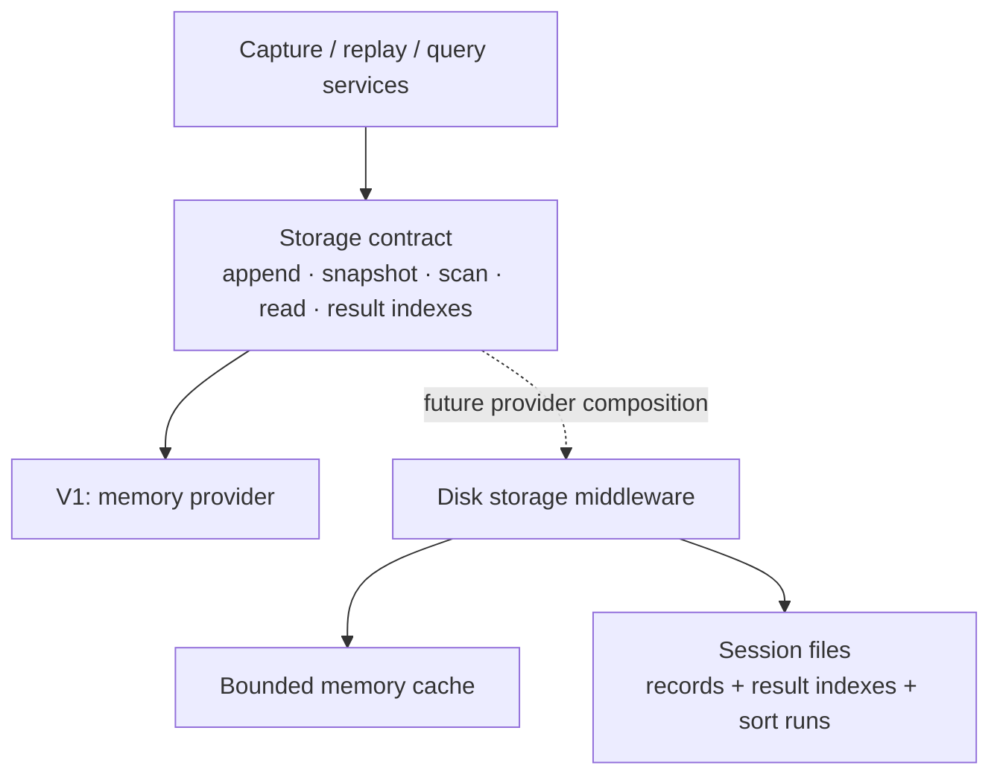

# Architecture

## Implemented scaffold

| Area | Responsibility |
| --- | --- |
| `cmd/streamline` | CLI port/configuration directory, loopback listener, source-manager and settings-store injection, graceful shutdown |
| `internal/httpapi` | Versioned source/query/configuration JSON endpoints, bounded row/raw pages, SSE state notifications, and health |
| `internal/configuration` | Versioned saved documents, validation, configuration directories, atomic JSON file storage |
| `internal/query` | In-memory query lifecycle, immutable snapshot boundaries, live result indexes, subscriptions, and compiler boundary |
| `internal/logmodel` | Universal typed log records, source formats, parser diagnostics, and deep cloning |
| `internal/source` | Independent stdin/command captures, process groups, lifecycle, source registry |
| `internal/ingest` | Reader capture, commit batching, deferred terminal publication |
| `internal/parse` | Streaming framing, terminal sanitization, stream classification, and journald/JSON/logfmt/syslog/HTTP access/text normalization |
| `internal/webassets` | Embedded frontend in release builds; development build excludes assets |
| `web` | Svelte 5 viewer controller, HTTP/SSE client, 32 MB page cache, dark application shell, and segmented virtual log table |
| UI foundations | shadcn-svelte configuration, Bits UI, dark neutral theme, class utility, and Lucide icons |
| Installed for later | ECharts |

The server uses Go's standard library and builds with CGo disabled.
Stdin and command ingestion are implemented. The query service applies field
filters and plain/regexp search in input order. Profiles, graphs, and a shared
filter-expression syntax remain future work. See [Command log sources](command-sources.md)
for process ownership, lifecycle diagrams, and debugging entry points.
See [parser flow and revisitable decisions](parser.md) for the implemented
normalization boundary. [Saved configurations](saved-configurations.md) documents
file persistence, live snapshots, and command preparation.

## Implemented binary–frontend protocol

All application routes use `/api/v1`. Commands and bounded data use JSON over
HTTP; SSE announces source-list and query/session state without log rows.
The routes below are stdin aliases; each also exists under `/sources/{id}`.
See [source endpoints](transport.md#independent-command-sources).

| Route | Contract |
| --- | --- |
| `GET /session` | Session/generation identity, input status, and pending/records/raw kind |
| `GET /input/raw` | Read generation-guarded display-safe raw stdin chunks |
| `POST /queries` | Create an immutable filter/sort query; returns `202` with `building` or `ready` state |
| `GET /queries/{id}` | Resynchronize authoritative progress and latest snapshot |
| `GET /queries/{id}/rows` | Read `offset`/`limit` rows from an opaque `snapshot` token; default 200, maximum 1,000 |
| `GET /queries/{id}/events` | Initial state followed by coalesced progress, snapshot, input, and generation events |
| `DELETE /queries/{id}` | Cancel and release a query without deleting captured records |

Snapshots carry session, generation, query, revision, processed-input boundary,
matching count, and token. Identifiers and 64-bit values are decimal strings in
JSON. A token captures a logical prefix of a query's matching-ID index, so its
pagination remains stable while newer revisions append matches. Query scans
catch up records accepted during their initial scan before publishing the first
complete snapshot.

Each SSE subscription gets current state before later notifications, has a
one-item latest-state queue, and coalesces ordinary publication for 100 ms.
Streams send 15-second heartbeats and use five-second write deadlines. Connected
subscribers pin a query; disconnected queries have a 60-second grace period.
The browser resynchronizes through `GET` after stream errors rather than relying
on event replay.

The Svelte viewer keeps the previous results while a replacement filter builds,
then swaps only after the new query page is available. Every request is guarded
by a local intent and query/snapshot revision. Older-window navigation pauses
the displayed snapshot; Resume reads the current query state and jumps to its
latest tail. Full prefix pages can be reused between append-only revisions, but
a partial tail is refetched. A missing paused snapshot becomes an explicit
refresh state.

`query.Compiler` is the integration boundary for the future shared filter
expression tree. `MemoryService.Append`, `SetInputStatus`, and `SetRawOutput`
are the ingestion integration hooks. A future profile service emits generation events through the query-service
contract; the following frontend then builds an atomic replacement query.

## Implemented stdin path

One stdin stream comes from the user's shell, including SSH + tail, journalctl,
or Docker. The HTTP server starts immediately and ingestion runs in the
background. Memory may grow: the parser retains exact source bytes while the
stream is open, and the query service retains normalized records or terminal
raw chunks plus query indexes. There is no automatic eviction, database, disk
spill, or captured-session persistence. Named configurations use separate JSON
files. Bounded batches control publication latency, not retention.

- A valid journald JSON object, generic JSON object, complete logfmt line, syslog record, HTTP access record, or timestamped text line
  permanently selects parsed mode. Earlier unrecognized lines are emitted as
  text records; later lines remain records even when individually unrecognized.
- Until recognition, complete frames are buffered. If recognition never occurs,
  EOF or a read error publishes the whole input only as display-safe raw text.
- Framing handles LF, CRLF, lone CR, long lines, and a final unterminated line.
  Raw display normalizes line endings, strips terminal controls, and replaces
  invalid UTF-8 while preserving visible whitespace.
- Parsed records are committed progressively. Raw fallback is necessarily
  withheld until EOF or error establishes that no log record was recognized.
- EOF and read errors do not stop the web server. Session and SSE state report
  the terminal status; a read error uses the stable `input_read_error` code.
- HTTP JSON carries requests/results; SSE carries small progress/change
  notifications. Responses identify session, generation, query revision, and
  processed-input boundary. SSE announces raw readiness but never carries raw
  content or parsed rows.
- The virtualized list renders fixed-height summaries and fetches about 200 rows
  at a time, with a 32 MB page-cache target. Rebase scrolling windows to support
  millions of rows within browser height limits. Details open separately.
- Pausing the view or disconnecting the browser does not stop capture. EOF
  flushes pending records and leaves the viewer running.

`ingest`, `parse`, `query`, and `configuration` live under `internal/`.
Replay profiles and persistent log storage remain future work.

## Parser decision boundaries

The [parser specification](parser.md) separates source configuration from
record interpretation, stream classification, and terminal status publication.
These decisions have different owners and lifetimes. Detection consumes sanitized
line contents, not filenames, extensions, or command names. A source can alternate
between JSON, syslog, access records, and fallback text without changing its mode.

For a practical entry point, see the [parser overview](parser.md#start-here),
[detection examples](parser.md#detection-examples), and
[troubleshooting guide](parser.md#troubleshooting-detection).

Text mode bypasses per-frame format selection and initializes recognition to
true. Auto uses explicit precedence: JSON-shaped input (journald specialization
before generic JSON), complete logfmt, syslog, HTTP access, timestamped text,
and text fallback.
A parser candidate can match its initial shape and then fail decoding; that
failure stops selection for the line and returns text with diagnostics. Only a
non-candidate proceeds to the next parser. Successful structural recognition can
survive normalization issues such as an invalid date. See
[candidate versus recognition](parser.md#candidate-selection-versus-log-recognition).

The same source can contain several `SourceFormat` values. A text record is not
evidence of configured Text mode, and `raw` is a result variant rather than a
parser choice.

Recognition enables parser callbacks; ingestion batching determines when query
records become visible. Terminal status is published independently. For command
sources, pipe EOF must be combined with process completion before reporting
success or failure. Exact source intervals exist at the parser boundary;
ingestion transports normalized entries and does not retain those intervals.
See [selection](parser.md#parser-selection-and-extension),
[classification](parser.md#stream-classification-state-machine), and
[publication](parser.md#capture-publication-and-terminal-status) for the detailed
algorithms and transition diagrams.

## Planned extensions

- Declarative profiles can replay retained source into a new generation and
  switch atomically after catching up. Source retention beyond the current
  process-lifetime parser result must be designed before adding replay.
- Queries can adopt a shared expression tree for the filter builder and text
  syntax. Additional sort orders must define whether they are live or fixed at
  query creation.
- Graphs can show volume over time and severity/service/container counts, with
  Go aggregating the complete matching snapshot into bounded chart data.
- Docker wrappers, journal text/export formats, explicit multiline grouping,
  and nested message parsing require additional recognizers; they are not part
  of the implemented classification rules.

## Later: storage middleware

This is a future log-storage extension boundary. Saved configuration files do
not implement captured-record or query-index persistence.

Use logical record IDs and opaque snapshot tokens, never expose memory-store
slices to query services. The provider must support:

| Operation | Extension requirement |
| --- | --- |
| Append raw and normalized batches | Publish complete batches with stable IDs and generation boundaries |
| Snapshot and scan | Read a consistent record boundary in batches |
| Read IDs / original input | Serve arbitrary viewport windows, details, and profile replay |
| Create/read result indexes | Let large matching-ID lists and sort runs move out of RAM too |
| Release generations/results | Reclaim resources when investigations are retired |
| Statistics/errors/close | Report capacity and propagate failures through the same API |

A later middleware wraps a bounded memory cache. It intercepts writes and
stores a record before allowing its hot copy to be evicted. Reads check memory
and then disk; scans combine both tiers in logical order without duplicates.
A write-only archive hook would not make older logs searchable.

Preserve snapshots and generation semantics across providers. Storage failures
must not silently discard accepted records. Persisted formats need versioning
if session reopening is added. Select providers through ordinary Go composition
and a startup factory; runtime plugin loading is unnecessary. Run the same
contract tests against memory and future persistent providers.

## References

- [Frontend visual output](frontend.md)
- [Keyboard navigation framework](keyboard-navigation.md)
- [Saved configurations](saved-configurations.md)
- [shadcn-svelte](https://www.shadcn-svelte.com/docs)
- [TanStack Svelte Virtual](https://tanstack.com/virtual/latest/docs/framework/svelte/svelte-virtual)
- [Journal export formats](https://systemd.io/JOURNAL_EXPORT_FORMATS/)

## General search pipeline

See [General log search](search.md) for architecture, execution flow, and design choices.

`internal/query/search.go` owns pure line parsing, matcher compilation, scalar
traversal, and record predicate composition. `MemoryService.Create` compiles the
existing `Compiler` predicate first and general search last. Initial scans,
catch-up, and live appends use that same immutable composed predicate before
adding IDs to result indexes. Future permanent filters must precede search.

Search visits original nested field values and normalized timestamp, severity,
and meaningful message values. It excludes keys, paths, IDs, diagnostics, and
source-format metadata. `Record.MessageIsJSON` is internal provenance: parser
messages serialized from containers/non-string values are display fallbacks,
so search traverses their original Fields instead of matching serialized keys.
Actual string messages (including JSON-looking strings) remain searchable.

Each line matches independently against individual scalar values. OR combines
whole-record results; AND requires every line to match in the same record.
Numbers retain their JSON representation; containers are never concatenated.
Compilation is once per query, case-insensitive by default, with literal
expressions escaped through `regexp.QuoteMeta`. Empty search is the identity.

## Command source execution

[Command log sources](command-sources.md) documents manager/process ownership,
Auto/Text parsing, Stop and shutdown sequencing, source switching, decisions,
and debugging/tests. [Transport](transport.md#independent-command-sources) owns
the wire contract; [frontend](frontend.md#source-viewer-lifecycle) owns rendering.
