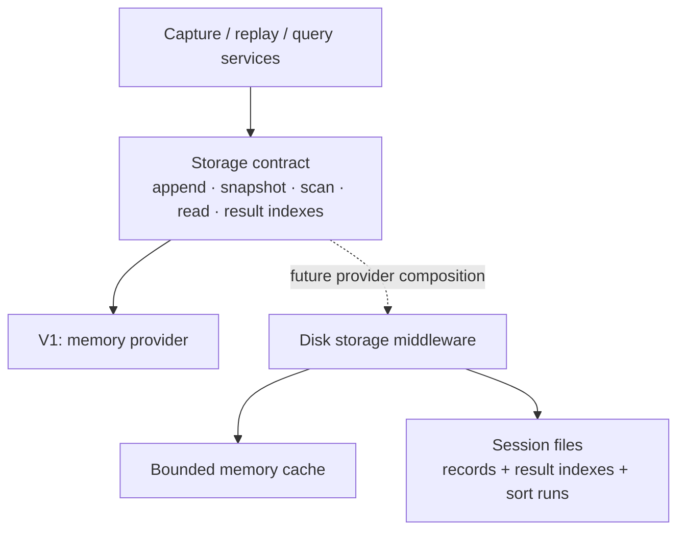

# Architecture

## Implemented scaffold

| Area | Responsibility |
| --- | --- |
| `cmd/streamline` | CLI port, loopback listener, background stdin startup, graceful shutdown |
| `internal/httpapi` | Versioned session/query JSON endpoints, bounded row/raw pages, SSE state notifications, and health |
| `internal/query` | In-memory query lifecycle, immutable snapshot boundaries, live result indexes, subscriptions, and compiler boundary |
| `internal/logmodel` | Universal typed log records, source formats, parser diagnostics, and deep cloning |
| `internal/ingest` | Progressive stdin coordination, commit batching, EOF/error publication |
| `internal/parse` | Streaming framing, terminal sanitization, stream classification, and journald/JSON/text normalization |
| `internal/webassets` | Embedded frontend in release builds; development build excludes assets |
| `web` | Svelte 5 viewer controller, HTTP/SSE client, 32 MB page cache, dark application shell, and segmented virtual log table |
| UI foundations | shadcn-svelte configuration, Bits UI, dark neutral theme, class utility, and Lucide icons |
| Installed for later | ECharts |

The server uses Go's standard library and builds with CGo disabled.
Stdin ingestion is implemented. No shared filter-expression compiler, profiles,
or graphs are implemented. The production service currently accepts the
unfiltered input-order query.
See [parser flow and revisitable decisions](parser.md) for the implemented
normalization boundary.

## Implemented binary–frontend protocol

All application routes use `/api/v1`. Commands and bounded data use JSON over
HTTP; SSE only announces authoritative query/session state and never carries log
rows.

| Route | Contract |
| --- | --- |
| `GET /session` | Session/generation identity, input status, and pending/records/raw kind |
| `GET /input/raw` | Read generation-guarded display-safe raw stdin chunks |
| `POST /queries` | Create an immutable filter/sort query; returns `202` with `building` or `ready` state |
| `GET /queries/{id}` | Resynchronize authoritative progress and latest snapshot |
| `GET /queries/{id}/rows` | Read `offset`/`limit` rows from an opaque `snapshot` token; default 200, maximum 1,000 |
| `GET /queries/{id}/events` | Initial state followed by coalesced progress, snapshot, input, and generation events |
| `DELETE /queries/{id}` | Cancel and release a query without deleting captured records |

Snapshots carry session, generation, query, revision, processed-input boundary,
matching count, and token. Identifiers and 64-bit values are decimal strings in
JSON. A token captures a logical prefix of a query's matching-ID index, so its
pagination remains stable while newer revisions append matches. Query scans
catch up records accepted during their initial scan before publishing the first
complete snapshot.

Each SSE subscription gets current state before later notifications, has a
one-item latest-state queue, and coalesces ordinary publication for 100 ms.
Streams send 15-second heartbeats and use five-second write deadlines. Connected
subscribers pin a query; disconnected queries have a 60-second grace period.
The browser resynchronizes through `GET` after stream errors rather than relying
on event replay.

The Svelte viewer keeps the previous results while a replacement filter builds,
then swaps only after the new query page is available. Every request is guarded
by a local intent and query/snapshot revision. Older-window navigation pauses
the displayed snapshot; Resume reads the current query state and jumps to its
latest tail. Full prefix pages can be reused between append-only revisions, but
a partial tail is refetched. A missing paused snapshot becomes an explicit
refresh state.

`query.Compiler` is the integration boundary for the future shared filter
expression tree. `MemoryService.Append`, `SetInputStatus`, and `SetRawOutput`
are the ingestion integration hooks. A future profile service emits generation events through the query-service
contract; the following frontend then builds an atomic replacement query.

## Current stdin path and planned first version

One stdin stream comes from the user's shell, including SSH + tail, journalctl,
or Docker. The full session stays in memory until exit. Memory may grow; there
is no automatic eviction, database, disk spill, or application persistence.
Ten million 1 KB records require roughly 10 GB for raw input, plus parsed data
and query indexes. Bounded queues control processing backlog, not retention.

```mermaid
flowchart LR
  Input["stdin<br/>SSH / tail / journalctl / Docker"] --> Capture["Raw capture"]
  Capture --> Raw["Raw records in RAM"]
  Capture --> Parse["Framing → parsing → profile rules"]
  Parse --> Events["Normalized records in RAM"]
  Raw --> Replay["Profile replay"]
  Replay --> Parse
  Events --> Query["Go query engine<br/>filters / sort / aggregation"]
  Query --> Results["Matching IDs and counts in RAM"]
  Results --> API["Go HTTP + SSE"]
  API -->|"requested rows and chart buckets"| UI["Svelte viewer"]
  UI -->|"query and viewport requests"| API
  API --> Query
```

- Go owns parsing, extraction, filtering, sorting, and graph calculations.
  The browser handles presentation and requests bounded data windows.
- Parse JSON Lines, journal JSON/text, Docker wrappers, and plain text.
  Preserve raw input; normalize ANSI/CRLF for display. Optional explicit
  multiline rules group stack traces.
- Declarative profiles are edited in the UI. Applying a profile replays raw
  records into a new generation and switches atomically after catching up.
- Queries use a shared expression tree for the filter builder and text syntax.
  Batched scans create packed matching-ID indexes; live queries evaluate new
  batches. Other sort orders use a fixed snapshot.
- HTTP JSON carries requests/results; SSE carries small progress/change
  notifications. Responses identify session, generation, query revision, and
  processed-input boundary. Rows and aggregates share a revision.
- The virtualized list renders fixed-height summaries and fetches about 200 rows
  at a time, with a 32 MB page-cache target. Rebase scrolling windows to support
  millions of rows within browser height limits. Details open separately.
- Planned graphs show volume over time and severity/service/container counts.
  Aggregate the entire matching dataset in Go, returning bounded chart data.
- Pausing the view or disconnecting the browser does not stop capture. EOF
  flushes pending records and leaves the viewer running.

`ingest`, `parse`, and `query` now live under `internal/`; profile and
persistent storage packages remain future work.

## Later: storage middleware

This is a future extension boundary, not implemented storage code.

Use logical record IDs and opaque snapshot tokens, never expose memory-store
slices to query services. The provider must support:

| Operation | Extension requirement |
| --- | --- |
| Append raw and normalized batches | Publish complete batches with stable IDs and generation boundaries |
| Snapshot and scan | Read a consistent record boundary in batches |
| Read IDs / original input | Serve arbitrary viewport windows, details, and profile replay |
| Create/read result indexes | Let large matching-ID lists and sort runs move out of RAM too |
| Release generations/results | Reclaim resources when investigations are retired |
| Statistics/errors/close | Report capacity and propagate failures through the same API |

A later middleware wraps a bounded memory cache. It intercepts writes and
stores a record before allowing its hot copy to be evicted. Reads check memory
and then disk; scans combine both tiers in logical order without duplicates.
A write-only archive hook would not make older logs searchable.

Preserve snapshots and generation semantics across providers. Storage failures
must not silently discard accepted records. Persisted formats need versioning
if session reopening is added. Select providers through ordinary Go composition
and a startup factory; runtime plugin loading is unnecessary. Run the same
contract tests against memory and future persistent providers.

## References

- [Frontend visual output](frontend.md)
- [shadcn-svelte](https://www.shadcn-svelte.com/docs)
- [TanStack Svelte Virtual](https://tanstack.com/virtual/latest/docs/framework/svelte/svelte-virtual)
- [Journal export formats](https://systemd.io/JOURNAL_EXPORT_FORMATS/)
