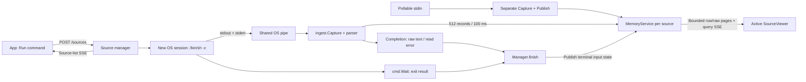
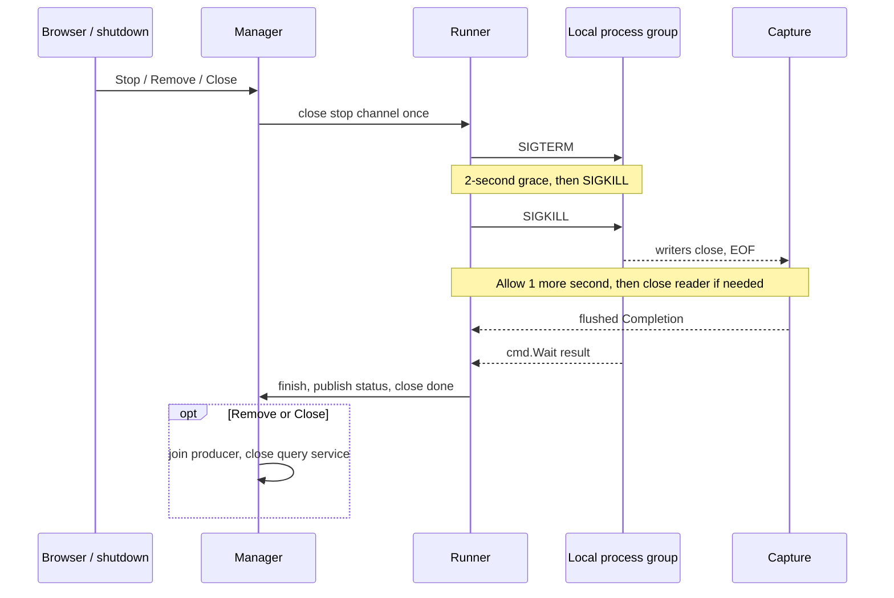

# Command log sources

Implemented: concurrent command tabs plus permanent stdin. Linux/macOS only;
`/bin/sh -c`, combined stdout/stderr, no interactive input or local PTY.

## Code map

| Owner | Entry points / responsibility |
| --- | --- |
| [main.go](../cmd/streamline/main.go) | `OpenStdin`, `StartStdin`, handler injection; close sources before signal-driven HTTP shutdown |
| [manager.go](../internal/source/manager.go) | Registry, descriptors, source notifications; `Create`, `Stop`, `Remove`, `Close`, `finish` |
| [process_unix.go](../internal/source/process_unix.go) | Shell, OS pipe, process group, concurrent capture/wait, termination deadlines |
| [stdin_unix.go](../internal/source/stdin_unix.go) | Pollable stdin duplicate; interrupt pending reads and restore original descriptor flags |
| [stdin.go](../internal/ingest/stdin.go) | `Capture` flushes batches; `Completion.Publish` commits terminal state |
| [sources.go](../internal/httpapi/sources.go) | Source JSON/SSE routes, scoped query dispatch, Host/Origin/header checks |
| [App.svelte](../web/src/App.svelte) | Command form, selected source, descriptors, preference map, shared keyboard registry |
| [SourceViewer.svelte](../web/src/lib/components/SourceViewer.svelte) | One mounted viewer: controller, queries/cache, panels, row selection, preference restoration, live snapshot/application |
| [sources.ts](../web/src/lib/transport/sources.ts) | `HTTPSourceAPI`, `SourcePreferences`; wire descriptors are `LogSource` in `types.ts` |

## Data flow



Each source has its own query service, parser invocation, and session identity.
Command IDs are `command-` plus the random query-session ID; generations and row
IDs are source-local. Existing unscoped query routes remain stdin aliases.
See [transport contracts](transport.md#independent-command-sources) for endpoints.

## Execution decisions

| Decision | Consequence / extension constraint |
| --- | --- |
| Shell text passed unchanged to `/bin/sh -c` | Quotes, pipes, redirects, and expansion use POSIX shell rules; inherit binary cwd/environment. `shellPath` is a private startup-test seam. |
| New OS session via `Setsid`; null stdin | Isolates command input from app stdin and enables group signals. PTY/input forwarding requires a separate transport and terminal lifecycle. |
| One pipe for stdout and stderr | Preserve received bytes; stream identity and independent buffering order are unavailable. Close the parent's writer immediately after Start. |
| Auto is the default | JSON objects, complete logfmt, syslog, HTTP access, or timestamped text establish parsed output. Unrecognized output is buffered until recognition or terminal raw fallback. Text bypasses recognition and emits sanitized retained frames. |
| Capture and terminal publication are separate | Pipe EOF alone is insufficient: process exit may still fail. Flush final records/partial lines before `finish` publishes status. |
| Browser lifetime does not own capture | Switching, reload, query expiry, and disconnect never stop a process. Run again discards the old capture and creates a replacement in the same UI tab. |
| In-memory retention | Parser buffers and query data can grow. Batch/page limits do not cap total capture memory; persistence/eviction need explicit ownership rules. |

Configured source mode, per-record `SourceFormat`, query `InputKind`, and terminal
`InputStatus` are separate domains. `mode=text` maps to `Options.Text=true` for a
new command capture; stdin always uses Auto. The parser specification defines
[mode semantics](parser.md#configured-modes),
[selection precedence](parser.md#parser-selection-and-extension), and
[capture/publication ordering](parser.md#capture-publication-and-terminal-status).

Text mode does not expose structured fields or normalized timestamps/severity.
Command columns default to `timestamp`, `severity`, `message` when no explicit
settings are inherited. Stdin keeps its existing defaults. Run from a configured
source inherits applied columns, filters, and search; see
[saved configurations](saved-configurations.md#state-transitions). SSH needs preconfigured authentication; use `-tt` if a remote
PTY is required without a local tty. Commands are never rewritten automatically.

## Completion and cleanup

| Lifecycle | Query input status | Retained result |
| --- | --- | --- |
| `starting → running → exited` | `eof` after capture and wait complete | Parsed rows or raw text; exit code 0 |
| `starting → failed` | `error` | Startup error; no exit code |
| `running → failed` | `error` | Partial/full output plus process/read error |
| `starting/running → stopping → stopped` | `eof` | Captured output; intentional Stop suppresses process/read errors |

Terminal sources remain inspectable. Repeated Stop is a no-op. Exit code `-1`
means signal termination. `Remove` waits for the producer's `done` channel before
closing its query service; `Close` requests all command stops before joining them.
Stdin cannot be stopped or removed through the source API.



- Natural shell exit with an open output pipe starts the same two-second deadline;
  inherited descriptors must not keep capture alive indefinitely.
- Forced reader closure sets `command_output_timeout`; other stable errors are
  `command_start_failed`, `command_exit_failed`, and `input_read_error`.
- Capture uses a background context; owners close blocking readers before joining.
  Context cancellation alone cannot interrupt an arbitrary `io.Reader`.
- `OpenStdin` duplicates the descriptor and enables Go polling. Closing ordinary
  blocking `os.Stdin` can otherwise hang shutdown while the producer is still open.
- Group cleanup does not guarantee termination of deliberately detached or remote
  processes. Windows, auto-restart, captured-session persistence, and command CLI
  flags are absent. Named command/viewer configurations have separate file persistence.

## Viewer switching and notifications

1. `TabController` owns stable UI tab IDs, source IDs, command/mode drafts,
   applied preferences, pending operations, and errors. Stdin is fixed; + creates
   a local blank command tab with default normalized columns.
2. `App` keys `SourceViewer` by tab and source identity. Disposal saves preferences
   only if the tab still owns that source, then releases queries, subscriptions,
   requests, and pages. Preferences never retain old pages or snapshot tokens.
3. Switching restores applied filters/search, columns/date formats, row height,
   follow state, and the selected result offset. Draft commands remain per tab.
4. Run snapshots applied settings, awaits DELETE (including process cleanup), and
   POSTs the new command into the same UI tab. It clears position/selection and
   follows new output while preserving row height and other applied settings.
   Run again uses the last executed command/mode; editor drafts are unchanged.
5. Mutations are serialized per tab. Failed deletion retains the source; failed
   creation after deletion retains a prepared tab with its draft and error.
   Unknown event sources are deferred during creates to avoid duplicate tabs
   when SSE precedes HTTP. Completion never selects a different tab.
6. Closing or external deletion selects the right neighbor, otherwise the left.
   Blank tabs survive source-list updates. Reload selects stdin and discovers
   backend runs; blank tabs, drafts, preferences, and UI ordering are not persisted.
   A reload during delete-then-create can interrupt replacement between requests.

Saved configurations remain separate persistent files. Load never executes:
command configurations loaded from stdin open a prepared tab, while existing
command tabs receive settings/drafts in place.

One source-list EventSource remains open; only the active viewer owns query SSE
(two query streams may overlap during filter replacement). Source notifications
use a one-slot invalidation queue and send the full descriptor list on connection
and changes. They do not use the query stream's 100 ms timer. Both streams use
15-second heartbeats and five-second write deadlines; neither carries log rows.
`TabController.revision` rejects stale initial lists; per-tab mutations never
override the current selection; viewer guards reject stale row/query
responses. Preserve these boundaries when adding sources or reconnect behavior.

## Debugging and verification

Stdin and command captures share content-based parser detection. Source commands
and file extensions do not select formats. Consult the
[parser detection examples](parser.md#detection-examples) and
[parser troubleshooting table](parser.md#troubleshooting-detection) when output
is raw, fields are missing, or prefixes prevent structured decoding. Loading a
saved output mode prepares a new run; it does not reparse existing source rows.

| Symptom | Inspect first |
| --- | --- |
| Running command, no visible output | Auto detection vs Text, child buffering, final newline, SSH authentication; then pipe writer ownership |
| Stop or shutdown hangs | Group PID/signals, `waited`/`captured` channels, inherited descriptors, `OpenStdin` pollability |
| EOF hides a command failure | `Capture` must defer terminal publication to `finish`; inspect source and query error/status together |
| Wrong rows/preferences after tab switch | Scoped API URL, keyed viewer disposal, saved applied spec/offset, initial editor props, intent/revision guards |
| Source controls return 403/415 | Backend `localRequests`: loopback Host, Origin or Fetch Metadata, JSON content type, `X-Streamline-Request: 1`; dev proxy Origin allowlist |
| Source list stale but rows update | `/sources/events` reconnect and full-list replacement; classification/lifecycle notification in `sourceSink`/manager |

```sh
make check
CGO_ENABLED=1 go test -race -tags=dev ./internal/source ./internal/httpapi ./internal/ingest
make build
bun run --bun --filter @streamline/web test:e2e commands.spec.ts
```

- [Manager tests](../internal/source/manager_test.go): live/finite/large output,
  shell syntax, isolation, failed startup/exit, repeated Stop, resistant background
  writers, inherited descriptors, removal, and open-stdin shutdown.
- [HTTP tests](../internal/httpapi/sources_test.go): scoped queries, stdin aliases,
  request rejection, lifecycle events, reconnect. [Browser tests](../web/e2e/commands.spec.ts)
  run standalone binaries and cover tabs, reload, failures, late responses,
  cross-client deletion, and preference restoration. Build the binary first.
- Implementation verification passed on Linux, including race checks. macOS
  cross-compilation passed; native process cleanup remains unverified.
- The optional terminal-dataset test checks raw fallback and safe display. It
  does not require standalone pager frames in every local capture; deterministic
  parser tests verify skipped-pager diagnostics. The former assertion was
  confirmed to fail with the baseline selector before being corrected.
