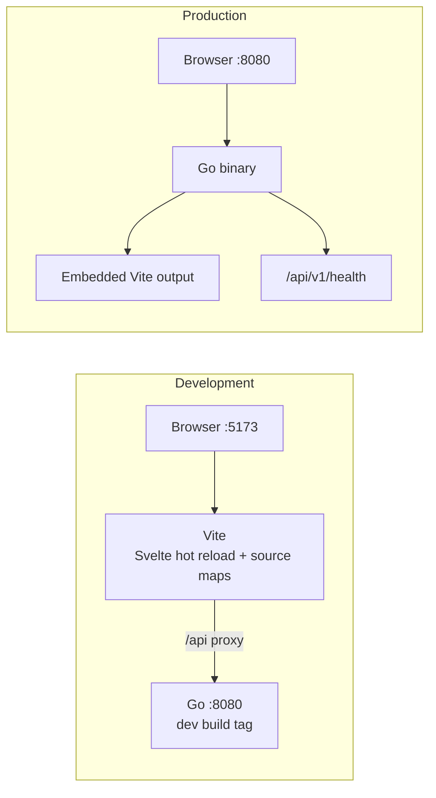

# Development

## Setup

Requirements: Linux with Go 1.27.1 or newer installed globally via Linuxbrew,
Bun 1.4.0 or newer installed globally, Make, and internet access for the initial
dependency installation.

If Go is not installed yet, run `brew install go`. Install Bun using the
[Bun installation instructions](https://bun.com/docs/installation).
For direct tool commands, add both global installations to your shell's `PATH`:

```sh
eval "$(/home/linuxbrew/.linuxbrew/bin/brew shellenv)"
export PATH="$HOME/.bun/bin:$PATH"
go version
bun --version
make setup
```

Make inherits `PATH`; the tool-path additions in `Makefile` are commented out.
Configure `PATH` in noninteractive shells and VS Code tasks, or override `GO`,
`GOFMT`, and `BUN` with executable paths.

Setup checks the global Go and Bun versions and installs frontend dependencies
with `bun install --frozen-lockfile`. The required Go version comes from
`go.mod`; the Bun minimum and package manager version live in the root
`package.json`. Go has no external module dependencies. `GOTOOLCHAIN=local`
keeps Go commands on the installed compiler; upgrade it with `brew upgrade go`
when increasing the version in `go.mod`.

The root `package.json` declares the `web` workspace. `bun.lock` records resolved
dependency versions and integrity hashes. Run `bun install` after changing
package dependencies and include the updated lockfile with those changes.
Frontend commands and the development process runner use Bun's runtime through
`bun run --bun`.

## Commands

| Command | Behavior |
| --- | --- |
| `make setup` | Check global Go/Bun versions and install locked dependencies |
| `make dev` | Run API + Vite together; stop both on Ctrl+C or if either exits |
| `make dev-go` | Compile with `dev`; run API port 8080 with repository `.local/streamline` settings |
| `make dev-web` | Run Vite on localhost:5173 with hot reload |
| `make build` | Build frontend, embed it into `bin/streamline`, and bundle `bin/streamline.<GOOS>.<GOARCH>.tar.gz` |
| `make run` | Build and start the standalone binary |
| `make check` | Svelte/TypeScript diagnostics, frontend tests, Go tests/vet with `dev`, formatting check |

Builds default to the host OS and architecture. Override them with, for example,
`make build GOOS=darwin GOARCH=arm64`; the archive filename includes both target
values, using Go platform names.

Use `PORT=8081` with Make commands to change the API port; the Vite proxy uses
the same value. Keep `PORT` nonzero during development. The standalone binary
also accepts `-port 0` to choose a free port and prints its URL.

Saved configurations use `~/.config/streamline` in production. `make dev-go` passes
`-config-dir "$(CURDIR)/.local/streamline"`; this directory is ignored by Git.
Use `-config-dir /path/to/settings` for alternate or isolated test roots.
See [saved configurations](saved-configurations.md#persistence-contract).



The dark shell initially waits for stdin. Recognized logs appear in the virtual
table; terminal unrecognized input appears in the raw view after EOF. Check
connectivity at [development health](http://localhost:5173/api/v1/health) or
[standalone health](http://localhost:8080/api/v1/health).

Vite handles frontend changes immediately. Restart the Go process after Go
source changes; there is no backend watcher. The dev build works without
generated frontend assets.

## VS Code and Chromium

1. Run `make setup` once.
2. Open the project's root folder in VS Code.
3. Start `make dev` in a terminal or run the **Streamline: dev** VS Code task.
4. Open `http://localhost:5173` in the existing Chromium and ensure its debugger
   is reachable on `127.0.0.1:9222`.
5. Select **Attach to Streamline frontend** and start debugging.
6. Set breakpoints in `web/src/main.ts`, TypeScript, or Svelte scripts. For a
   startup breakpoint, set it and reload the tab.

The configuration attaches to the existing browser; it does not launch one.
**Start Streamline and attach** also starts the dev task before attaching;
use it when the servers are stopped and the Chromium tab is already open.
Detaching leaves the servers running; stop them through VS Code's task controls
or Ctrl+C.

If VS Code runs in a container or on a remote machine, the debugger address
must reach Chromium from there; forward port 9222 or adjust `address`.
Connection check: `curl http://127.0.0.1:9222/json/version`.

Recommended workspace extensions cover Svelte, Tailwind, Go, and Mermaid
previews. VS Code's Go settings use `/home/linuxbrew/.linuxbrew/bin/go` and the
`dev` build tag. If Homebrew uses a different prefix, update `go.alternateTools`
in `.vscode/settings.json` too. The Go extension discovers `GOROOT` from the
global compiler. Install Go editor tools separately when needed; they are not
application dependencies.

## Outputs and dependency commands

- `.cache/`: Go caches and the development binary.
- `.local/streamline/configs/`: development saved configuration JSON files.
- `node_modules/` and `web/node_modules/`: frontend dependencies.
- `internal/webassets/dist/`: generated frontend, including source maps.
- `bin/streamline`: standalone executable.
- `bin/streamline.<GOOS>.<GOARCH>.tar.gz`: release archive containing the executable and README.

These directories are ignored by Git. Saved configurations persist separately
from captured-session data: stdin source bytes, parsed records, raw chunks, and
query indexes are process-memory only and disappear when Streamline exits.

Bun uses its global download cache (normally `~/.bun/install/cache`). Existing
`.tools/` and `.cache/pnpm-store/` directories from the previous setup are no
longer used and can be removed. When switching an existing checkout from pnpm,
remove `node_modules/` and `web/node_modules/`, then run `make setup` to reinstall
from `bun.lock`. Restart any development servers after switching.

For direct Bun commands with the global tools on `PATH`:

```sh
bun run --bun --filter @streamline/web check
(cd web && bun x --bun shadcn-svelte@latest add button)
```

The second command is an example for adding a UI component later. The scaffold
only contains the shadcn configuration, theme, utility, and dependencies.

## Smoke checks

After `make check`, verify the stdin selector, waiting state, parsed table, raw
view, and health endpoint through Vite.
Stop development, run `make build`, and launch `bin/streamline` from another
working directory to check that assets are embedded. Verify unknown API paths
return 404 and Ctrl+C releases both development ports.

Verify saved-entry capture/edit/clone, Load without execution, and Run with
inherited columns/filters/search. Browser tests create temporary configuration
roots and exercise restart persistence:

```sh
bun run --bun --filter @streamline/web test:e2e configurations.spec.ts commands.spec.ts
```

See [Bun package management](https://bun.com/docs/pm/cli/install),
[Vite configuration](https://vite.dev/config/server-options.html) and
[VS Code browser debugging](https://code.visualstudio.com/docs/nodejs/browser-debugging).
