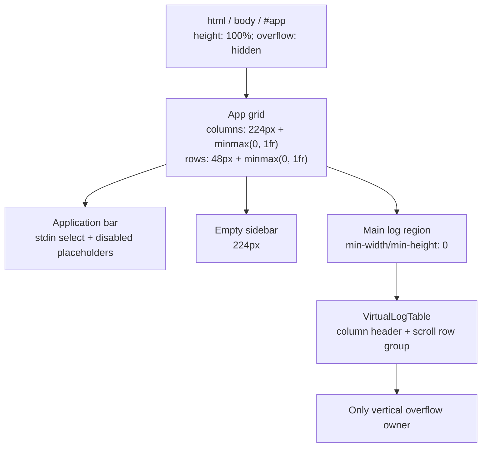
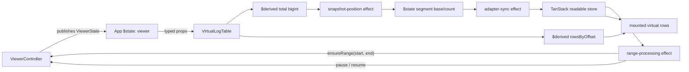
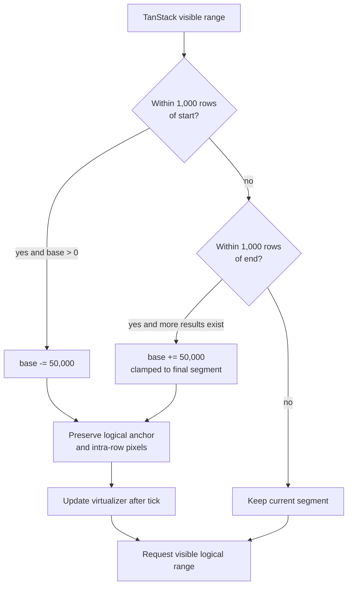
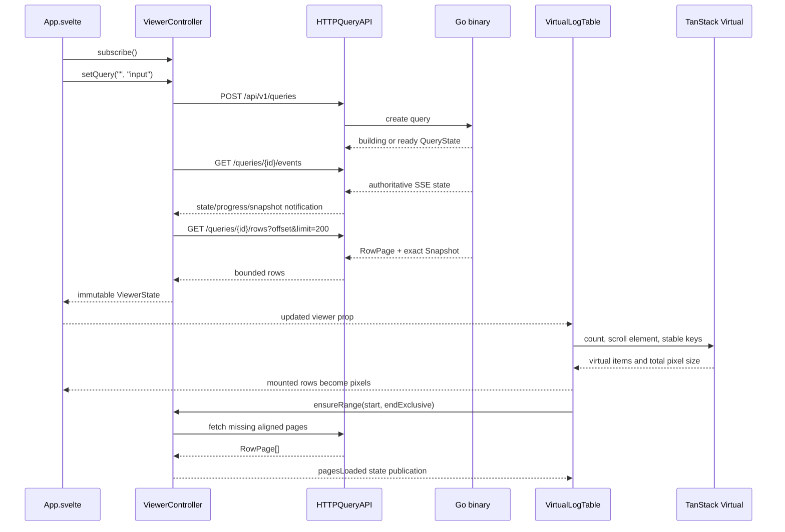
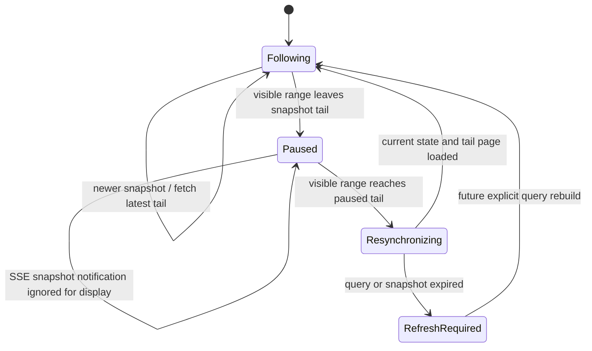

# Svelte visual output

This document describes how Streamline turns binary-owned query state into the
dark log table rendered by Svelte. It covers the current frontend shell,
reactivity, viewport paging, row virtualization, follow behavior, accessibility,
and the annotation conventions used by the code.

The frontend is a presentation client. Go owns stdin capture, classification,
parsing, result indexes, raw chunks, and immutable snapshots. Svelte owns the
browser lifecycle, visible state, scrolling, and DOM projection. It shows a
waiting state, parsed virtual rows, or terminal raw text according to session
`inputKind`.

## Source map

| Source | Responsibility |
| --- | --- |
| `web/src/App.svelte` | Root component, controller ownership, full-viewport shell |
| `web/src/app.css` | Dark-only tokens, Tailwind theme mapping, viewport containment |
| `web/src/lib/components/VirtualLogTable.svelte` | Parsed table, Svelte runes, TanStack adapter, scroll/follow behavior |
| `web/src/lib/components/RawOutput.svelte` | Preformatted raw text and sequential chunk loading |
| `web/src/lib/virtual-window.ts` | Bigint-safe segment and page-coordinate calculations |
| `web/src/lib/transport/viewer-controller.ts` | Query lifecycle, SSE recovery, page loading, race guards |
| `web/src/lib/transport/viewer-state.ts` | Immutable display model and pure reducer |
| `web/src/lib/transport/page-cache.ts` | Approximate 32 MB row-page LRU |
| `web/src/lib/transport/api.ts` | HTTP commands, row reads, and EventSource notifications |
| `web/src/lib/transport/types.ts` | Browser representation of the binary wire contract |

## Visual shell and containment

`html`, `body`, and `#app` are all exactly the viewport height and hide document
overflow. `App.svelte` then creates a two-column, two-row CSS grid:

- row 1 is a 48 px application bar with the stdin source select and spans both columns;
- column 1 is the empty 224 px sidebar below the bar;
- the remaining cell is the log surface;
- `minmax(0, 1fr)`, `min-h-0`, and `min-w-0` allow the log surface to shrink
  within the grid instead of forcing document-level overflow;
- the virtual table's row-group element is the only vertical scroll container.

`App.svelte` keeps the sidebar empty. The header contains a native source
select with stdin active and disabled file/command placeholders.



The design is dark-only. `:root` declares `color-scheme: dark` and owns the
semantic OKLCH palette. Tailwind's inline theme maps those variables to utilities
such as `bg-background`, `bg-shell`, `bg-table-header`, `text-log-level`, and
`bg-placeholder`. There is no `.dark` selector, media-query negotiation, theme
toggle, or light fallback.

The table uses three matching CSS-grid templates for its header and rows:
`12rem 7rem minmax(0, 1fr)`. Time and level are fixed-width scan columns. Message
takes all remaining width and truncates rather than changing row height. Every
summary row is 32 px high, which is a rendering invariant used by both CSS and
the virtualization math.

## Root component lifecycle

The root creates one `ViewerController` per mounted `App` component and seeds a
Svelte `$state` value from `controller.state`. During `onMount` it:

1. subscribes to complete immutable `ViewerState` snapshots;
2. assigns each snapshot to the reactive `viewer` value;
3. calls `start()`, which reads the session and chooses query or raw mode;
4. returns cleanup that unsubscribes, aborts requests, closes EventSource
   connections, releases server queries, and clears the page cache.

The controller is created before mount, but network and browser-lifecycle work
starts only in `onMount`. This keeps resource ownership aligned with the Svelte
component lifetime.

`viewer` and `controller` are passed to either `VirtualLogTable` or
`RawOutput` as typed `$props`. Components do not call `fetch` or construct
`EventSource` directly; they express viewport or next-chunk intent to the controller.

## Input-mode rendering

`App.svelte` renders Connecting before session recovery, Waiting for stdin while
classification is pending, the virtual table for `records`, and a scrollable
preformatted panel for `raw`. Raw pages load four chunks at a time and are
accepted only at the current generation and sequential offset.

## Reactive rendering inside VirtualLogTable

The virtual table has four kinds of Svelte state:

| Kind | Values | Purpose |
| --- | --- | --- |
| Props | `viewer`, `controller` | Immutable render input and imperative viewport API |
| `$state` | scroll element, segment base/count, movement flags | Browser-local interaction state |
| `$derived` | total match count, logical-offset row map | Recomputed projections of viewer state |
| TanStack readable store | virtual items, visible range, total pixel size | Headless DOM-window calculation |

The total match count is decoded from the snapshot's decimal string into a
`bigint`. The visible pages are indexed into a `Map<string, LogRow>` by logical
result offset. The map is intentionally sparse: missing offsets produce
fixed-height loading placeholders until their pages arrive.

Three ordered effects connect Svelte state to TanStack Virtual and the
controller:

1. **Adapter synchronization.** Segment count, segment base, and the bound scroll
   element are installed into the virtualizer. `getItemKey` returns the global
   logical offset, so a local index receives the correct identity after rebasing.
2. **Snapshot positioning.** A new snapshot token selects a tail segment while
   following or a head segment while paused. `tick()` waits for the new spacer
   geometry before an imperative scroll.
3. **Range processing.** TanStack's overscanned virtual items become a logical
   data range. The non-overscanned visible range decides segment rebasing and
   whether following should pause or resume.

`get(virtualizer)` is used for imperative option and scroll calls. The
`$virtualizer` auto-subscription is used where a store update should invalidate
the effect or template.



## DOM projection and visual states

The table is composed from ARIA table roles because its rows are absolutely
positioned rather than participating in native table layout:

- the outer surface has `role="table"` and an accessible name;
- the fixed 36 px header is a row group with Time, Level, and Message column
  headers;
- the scroll container is the body row group;
- mounted summary rows use `role="row"` and their three values use
  `role="cell"`;
- the time cell contains a semantic `time` element;
- unloaded rows keep the same geometry and expose `aria-busy` while their
  placeholder bars remain hidden from assistive technology.

At the application level, session classification selects the render path. The
query-specific rows below apply only after the input kind is `records`:

| Condition | Output |
| --- | --- |
| Session has not loaded | Centered “Connecting…” status |
| `inputKind` is `pending` | Centered “Waiting for stdin…” status |
| `inputKind` is `records`, query is building | Query progress status |
| `inputKind` is `records`, ready snapshot has zero matches | Centered “No log records.” status |
| `inputKind` is `records`, ready snapshot has matches | Virtual spacer and mounted rows/placeholders |
| `inputKind` is `raw` | Read-only monospace raw panel; “No stdin output.” when it has zero chunks |

Transport failures appear in a persistent alert strip above the table. Existing
rows remain visible when possible. Svelte inserts message content as text, so
log messages and fields are escaped rather than interpreted as HTML.

## Segmented virtualization

TanStack Virtual and browser scroll geometry use JavaScript numbers and CSS
pixels. Query counts and offsets use 64-bit values and may exceed
`Number.MAX_SAFE_INTEGER`. Streamline therefore never passes the global result
count directly to the virtualizer.

A `VirtualSegment` is a browser-sized window over the logical result space:

```text
global logical index = segment.base + local virtual index
segment pixel height = segment.count * 32
```

The segment constants are:

| Constant | Value | Reason |
| --- | ---: | --- |
| `SEGMENT_ROWS` | 100,000 | Bounds one scroll surface to 3,200,000 px |
| `SEGMENT_SHIFT` | 50,000 | Reuses half of the prior segment after rebasing |
| `SEGMENT_EDGE_ROWS` | 1,000 | Starts rebasing before the user reaches an edge |
| `ROW_HEIGHT` | 32 px | Makes logical/pixel conversion exact |
| `OVERSCAN_ROWS` | 12 | Hides normal rendering latency above and below the viewport |

A following snapshot starts with `base = max(0, total - 100,000)` and scrolls to
the final local item. A paused replacement starts at base zero. Only the
segment-local count is converted to `number`.

When the visible range approaches a segment boundary, `rebasedSegment` chooses
the adjacent segment. The component preserves both the first visible logical
row and the partial-row pixel offset:

```text
anchor = oldBase + visibleStart
intraRow = scrollTop - visibleStart * 32
newScrollTop = (anchor - newBase) * 32 + intraRow
```

`programmaticScroll` suppresses range-driven pause/resume decisions while the
segment changes. A monotonically increasing movement sequence prevents an older
`tick` or animation-frame completion from ending a newer programmatic move.



## Viewport-to-page mapping

TanStack returns mounted items with 12 rows of overscan. The component converts
the first and last mounted local indexes to global `bigint` offsets and calls:

```typescript
controller.ensureRange(start, endExclusive)
```

`pageOffsetsForRange` clamps that interval to `[0, matchedCount)`, aligns it to
200-row boundaries, and adds one page on each side. For example, a mounted range
`[410, 430)` requests page offsets `200`, `400`, and `600`.

`ViewerController` performs the actual reads. It:

- returns immediately for an already loaded range key;
- shares identical active range promises;
- deduplicates overlapping page requests by query, snapshot token, offset, and
  limit;
- checks the current query intent, range request number, query ID, and snapshot
  token before publishing;
- sends one `pagesLoaded` reducer action containing the small visible/prefetched
  page set;
- keeps older reusable pages in the separate 32 MB LRU.

A complete cached page is reusable across append-only snapshot revisions because
its prefix cannot change. A partial tail page is reusable only while the
snapshot match count remains unchanged.

## Binary-to-pixel sequence



Rows never travel through SSE. SSE carries small authoritative state
notifications; JSON HTTP requests carry bounded rows. On an EventSource error,
the controller reads `GET /queries/{id}` to resynchronize rather than assuming
every notification was replayed.

All identifiers, revisions, counts, and offsets that may exceed the safe integer
range stay decimal strings on the wire. Conversion to `bigint` happens only at
calculation boundaries. Conversion back to `number` happens only for bounded
segment-local indexes and pixel offsets.

## Follow and pause behavior

Following means the displayed snapshot may advance to newly announced revisions.
It does not control ingestion; Go can continue capturing while the browser is
paused or disconnected.

The visible non-overscanned range controls the mode:

- moving far enough away from the current snapshot tail calls `pause()`;
- while paused, snapshot notifications do not replace the displayed snapshot;
- reaching the paused snapshot's final row calls `resume()`;
- resume reads the current authoritative query state, fetches its latest tail
  page, publishes snapshot and rows atomically, and scrolls to the new tail;
- segment rebases and snapshot-driven tail positioning are programmatic and
  cannot accidentally pause the view.



## State reduction and consistency

`ViewerState` is an immutable projection, not a mutable store shared with the
transport. `reduceViewer` is the only function that applies controller actions.

| Action | Visible effect |
| --- | --- |
| `session` | Records the authoritative input kind/status used by the root renderer |
| `pending` / `progress` | Retains the prior display while a replacement builds |
| `replace` | Atomically installs a different query and its first page set |
| `extend` | Moves a following query to a newer snapshot and tail pages |
| `pagesLoaded` | Replaces visible/prefetched pages only for the exact token |
| `rawStart` | Clears query display state and opens an empty generation-bound raw view |
| `rawLoading` / `rawPage` | Deduplicates loading and appends only the expected sequential raw page |
| `pause` | Pins the displayed snapshot |
| `resume` | Atomically installs the current snapshot/tail and follows |
| `failed` | Keeps available rows and publishes a structured alert |
| `refreshRequired` | Pins cached rows and marks an expired paused view |

The guards serve different races:

| Guard | Prevents |
| --- | --- |
| query `intent` | A superseded query response replacing the active query |
| requested revision map | Older snapshot notifications fetching after newer ones |
| `rangeRequest` | A slower prior viewport replacing the current viewport pages |
| active range key | Duplicate publications while a range request is running |
| last loaded range key | A reactive render loop on an unchanged cached range |
| in-flight page key | Duplicate HTTP reads for overlapping viewport ranges |
| snapshot token checks | Rows from one immutable boundary appearing under another |

## Annotation audit

The frontend annotation pass uses JSDoc for exported or behavior-rich TypeScript
symbols and short implementation comments for anonymous Svelte effects.

| Area | Result |
| --- | --- |
| Wire aliases and objects | `Decimal`, status unions, diagnostics, errors, session, snapshot, query state, rows, pages, and events describe ownership and wire semantics |
| Viewer objects | `DisplayedQuery`, `ViewerState`, and `ViewerAction` document immutability, page scope, and follow/refresh meaning |
| Transport classes | `QueryAPI`, `HTTPQueryAPI`, `TransportError`, `PageCache`, and `ViewerController` have class/interface and method-level descriptions |
| Virtualization API | Every exported constant, `VirtualSegment` field, and calculation function explains its unit and invariant |
| Svelte component | Each effect has a responsibility comment; movement, rebase, completion, and page-index helpers have focused descriptions |
| Root lifecycle | `onMount` has an ownership comment and this document describes setup/cleanup ordering |

The following intentionally remain without individual JSDoc:

- one-line private `minBigInt` and `maxBigInt` arithmetic helpers;
- the private `Entry` cache shape, whose fields are local and self-describing;
- inline event callbacks and template expressions;
- CSS custom properties, which are grouped semantically in `app.css` and
  described above.

This is deliberate: annotating these would repeat syntax without explaining a
contract. New exported symbols, concurrency guards, unit conversions, snapshot
rules, or scroll-coordinate transformations should receive annotations.

## Safe extension rules

- Keep summary rows fixed at 32 px. Supporting wrapped or expanded rows requires
  TanStack `measureElement` and removal of the fixed anchor equations.
- When adding a visible column, change the header and row grid templates
  together and preserve one flexible message/data column.
- Continue using global logical offsets as `bigint`. Never convert
  `matchedCount` directly to `number`.
- Request rows only through `ViewerController.ensureRange`; components should
  not bypass race guards or the page cache.
- Keep SSE notification-only. New detail or aggregate payloads should use
  bounded HTTP endpoints tied to the same snapshot token.
- Use `@lucide/svelte` for future shell controls, importing individual icons and
  pairing icon-only actions with accessible names.
- A refresh affordance can later call `setQuery` with the displayed filter when
  `needsRefresh` is true; the current empty chrome intentionally exposes only
  the structured error state.

## Verification

`make check` validates Svelte/TypeScript diagnostics, viewport/controller/cache
unit tests, Go tests, Go vet, and Go formatting. `make build` verifies that Vite
output embeds in the standalone binary.

Frontend tests cover:

- query replacement and stale query responses;
- 200-row alignment and neighboring-page prefetch;
- identical request deduplication and stale range rejection;
- page-cache prefix reuse and partial-tail invalidation;
- head/tail segments, two-way rebasing, bigint anchors, and unsafe-integer
  result counts;
- paused snapshot reduction and token-mismatched page rejection;
- shared transport fixtures and structured row fields.

The production smoke check starts `bin/streamline`, loads the embedded root
document, and verifies `/api/v1/health`. Browser visual QA is separate from these
structural and behavioral checks.


## General search editor

See [General log search](search.md) for architecture, execution flow, and design choices.

`SearchEditor.svelte` sits below the table, outside its scrolling viewport, and
remains available for zero matches. It is shown only for parsed record input.
Text, Plain/Regexp mode, and OR/AND are drafts until Apply or Ctrl/Cmd+Enter.
Enter inserts a newline. Applying an empty search clears general search while
retaining permanent filters. There is no persistence or raw-output search.

`search.ts` provides pure line normalization, syntax checking, equality, and
server-error association helpers. Regexp mode constructs `new RegExp(line, 'iu')`
in try/catch for every nonblank line on edits and confirmation. It never runs
user regexps against logs in the browser. Plain mode bypasses syntax checks.
No WASM assets, workers, third-party validator, or build steps are involved.

The supported editor syntax is the overlap accepted by the browser and Go;
Go determines matching semantics. JS-valid lookaround/backreferences can still
fail on confirmation, producing backend line bullets. Full JS/Go semantic parity
is not promised and no syntax translation occurs. Useful expressions include
`timeout|refused`, `status=[45][0-9]{2}`, and `^error$`. Enter raw expressions,
without `/.../flags`; standalone Go flags such as `(?i)` fail JS validation.

The nonwrapping monospace editor synchronizes its error gutter during scrolling.
Every invalid line has a focusable bullet, hover/focus tooltip, and accessible
error description. Backend errors attach only to the submitted draft and are
cleared when the affected expression changes or Plain mode is selected. Older
in-flight responses cannot annotate a newer draft. The viewer keeps old rows
until a replacement query's first page is ready, including after validation errors.
