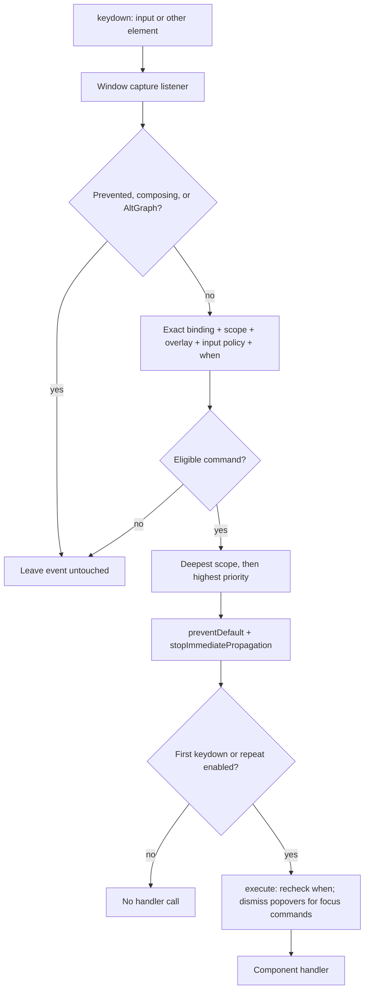

# Keyboard navigation framework

The frontend routes global application shortcuts through one `CommandRegistry`.
Components own command behavior; the registry owns matching, scope selection,
and dispatch. The tab strip handles its local navigation keys in `SourceTabs`.
There are no backend keyboard APIs or user-configurable keymaps.

## Source map

Paths below are relative to the repository root.

| Source | Responsibility |
| --- | --- |
| `web/src/lib/keyboard.ts` | `Command`, `KeyboardOverlay`, binding matching, registry, window listener, label formatting |
| `web/src/lib/keyboard-context.ts` | Svelte context and mount/unmount registration helpers |
| `web/src/App.svelte` | Registry ownership and window attachment across tab/source switches |
| `web/src/lib/components/SourceTabs.svelte` | Local tab keys, roving focus, close focus restoration, active-tab scrolling |
| `web/src/lib/components/SourceViewer.svelte` | Sidebar/Escape commands, active row, preview visibility; registrations follow mounted source |
| `web/src/lib/components/VirtualLogTable.svelte` | Row commands, `navigate`, virtual scrolling, focus restoration, selection/follow coordination |
| `web/src/lib/row-navigation.ts`, `web/src/lib/virtual-window.ts` | Navigation interfaces, bigint validation, clamping, bounded segments |
| `web/src/lib/components/{SearchEditor,ColumnSidebar,FilterEditor,TableToolbar}.svelte` | Editor focus, scoped Apply, filter insertion, jump input |
| `web/src/lib/components/{FilterEditor,SampleLogPopover,ConfigurationSettings}.svelte` | Modal and popover registration; settings owns scoped Save and dirty-dismissal guards |
| `web/src/lib/transport/{viewer-controller,viewer-state}.ts` | Page requests, immutable snapshots, pause/resume, stale-response guards |

## Ownership and registration

`App.svelte` provides one registry during component initialization and attaches
its capture listener on mount:

```ts
const keyboard = provideKeyboard();
onMount(() => keyboard.attach(window));
```

Descendants call `registerCommand` during initialization. The helper retrieves
context, registers in `onMount`, and returns the registry. The registry's
unregister function becomes the mount cleanup. `registerOverlay` uses the same
lifecycle. `useKeyboard()` retrieves the existing instance without registration.

Hidden sidebars remain mounted. Their global focus commands can open them;
scoped commands require their scope in the event path. Use live closures for
DOM refs, availability, and changing props rather than capturing initial values.
Duplicate IDs throw. Development builds warn about equivalent bindings with the
same scope and priority at registration time.

## Event routing



Capture runs before input bubbling handlers, so a widget's `stopPropagation()`
does not block designated global shortcuts. One matched command consumes the
event. Unmatched keys retain native behavior.

- `Mod` resolves to Meta on macOS and Ctrl elsewhere. Explicit `Ctrl` always
  means Control. Extra modifiers prevent a match.
- Letter matching uses `event.key`, preserving logical keyboard layouts. macOS
  Option-generated non-letter characters can fall back to `event.code`.
- Scope membership uses `event.composedPath()`. Scoped commands precede global
  commands; deeper scopes precede outer scopes. Priority breaks equal-depth ties.
- Inputs, textareas, selects, and editable content require `allowInInput: true`.
  Plain arrows, Tab, selection, and multiline Enter remain native in editors.
- Composition, legacy composition keycode 229, AltGraph, and already-prevented
  events are ignored. Repeated recognized keys are consumed but invoke handlers
  only when `repeat: true`.

### Command contract

| Property | Meaning/default |
| --- | --- |
| `id`, `label`, `handler` | Required identity, description, and sync/async action |
| `bindings` | Shortcut strings; omitted for programmatic-only commands |
| `scope` | Live element getter; omitted means global |
| `when` | Live availability predicate; only `false` disables |
| `allowInInput` | Defaults to false |
| `repeat` | Defaults to false; currently enabled for row movement |
| `priority` | Defaults to zero; resolves equal-depth candidates |
| `changesFocus` | Dismiss open non-modal overlays before invoking the handler |

`keyboard.execute(id)` checks registration and `when`, dismisses popovers for
focus commands, then awaits the handler. It does **not** apply event-path,
editable-input, modal, or repeat gating. Those checks belong to keyboard dispatch;
programmatic callers must choose an appropriate UI context. Execution does not
serialize or cancel handlers. Async race protection belongs to the component.

`keyboard.label(binding)` formats visible platform hints;
`keyboard.aria(binding)` formats `aria-keyshortcuts` modifier names. Keep the
binding passed to these helpers aligned with the command definition.

## Editors and overlays

Search illustrates scoped submission. This registration is inside
`SearchEditor.svelte`; `scope` is bound to its section and `apply()` retains the
existing validation and submission guards:

```ts
registerCommand({
  id: 'search.apply',
  label: 'Apply search',
  bindings: ['Mod+Enter'],
  scope: () => scope,
  allowInInput: true,
  handler: apply,
});
```

Columns and filters register the same combination against separate containers.
Only the focused block applies. Global editor commands opt into inputs and use
`changesFocus`. For example, `columns.focus` executes `columns.show`, awaits
Svelte rendering, then focuses and reveals the textarea. Sidebar drafts survive.

`filters.add` opens the sidebar and calls the same insertion function as the
button. After `tick()`, it focuses the new field by stable draft ID and calls
`scrollIntoView({ block: 'nearest' })`. Filter DOM order is field → operator →
value → remove. Add is the final form action; Tab order needs no positive indexes.

`KeyboardOverlay` supplies `open`, `modal`, `contains`, and `close` callbacks.
An open modal restricts dispatch to scopes inside it. The import dialog registers
its own scoped `Mod+Enter`. Escape is left to the overlay library; otherwise
`SourceViewer.svelte` closes preview before returning focus to the active row. Sample
popovers register async closing that awaits `tick()` before a focus command runs.

`ConfigurationSettings.svelte` registers a modal overlay and `configurations.save`
with scoped `Mod+Enter`. Bits UI traps focus and restores the toolbar trigger.
Escape/outside dismissal prevents closing while busy or while a dirty draft awaits
save/discard. See [saved configurations](saved-configurations.md#validation-and-interaction).

## Tab navigation

`SourceTabs.svelte` handles keydown on tab buttons locally; these keys are not
registered global commands and do not change text-editor navigation.

| Key/action | Behavior |
| --- | --- |
| Left/Right | Select and focus the previous/next tab, wrapping at either end |
| Home/End | Select and focus the first/last tab |
| Delete | Close the focused command tab; stdin and pending tabs ignore close |
| + button | Open a selected blank command tab, then focus its editor after `tick()` |
| Close button | Stop/discard that tab; active close selects right neighbor, otherwise left; background close preserves selection |

Only the selected tab button has `tabindex="0"`; others have `-1`. Separate
close buttons remain keyboard reachable. After a close initiated with focus in
the strip, focus returns to the selected tab unless the user moved focus outside
the strip while the operation was pending. A failed close keeps its tab and error.
Selection and resize scrolling reveal the whole active tab, including close.
There are no global new-tab/close-tab shortcuts.

## Row navigation and async focus

`ActiveRow` contains query ID, generation ID, zero-based `bigint` result offset,
and an optional loaded `LogRow`. Preview visibility is separate. The payload is
retained when its page leaves the visible page set; changing targets clears a
missing payload so preview shows loading/error feedback instead of the old row.

`RowNavigator` exposes `navigate(offset, focus?)` and `focus()`. Local row keys
and toolbar jumps request focus; global row keys pass `false` to preserve the
current input and selection. Jump input parses one-based result positions with
`parseRowJump`; source row IDs are unrelated to result positions.

`VirtualLogTable.navigate` performs the shared movement path:

1. Clamp the target, capture query snapshot and navigation sequence, and pause
   following. Selecting an older row sets `selectionPaused`.
2. Update active state; install `segmentForRow` if the target lies outside the
   current bounded segment. Only local offsets convert to `number`.
3. Await `tick()`, scroll with `align: 'auto'`, and request `ensureRange` around
   the target. Recheck navigation sequence and snapshot after async boundaries.
4. Queue focus if requested. `pendingFocus` waits for the virtual row to mount
   and checks focus ownership before moving DOM focus.
5. Finish the guarded programmatic scroll; resume when the target is the tail.

Only the active row has `tabindex="0"` and `aria-current="true"`. If virtualization
removes it, the scroll viewport becomes the stable Tab/focus fallback. A mounted
row can appear after `tick()` because scroll observers update the virtual range
later; focus restoration therefore also observes mounting.

Live updates activate the newest row without taking focus from an editor.
`selectionPaused` prevents auto-resume merely because the tail is still visible.
Returning to the last row or explicitly scrolling downward to the bottom resumes.
Successful query replacement resets to the newest result and closes old preview.

The guards are separate: `navigationSequence` invalidates obsolete target/focus
work; `moveSequence` protects scroll completion; controller `rangeRequest` and
snapshot checks protect page publication; `followRequest` invalidates pending
resume responses when another pause supersedes them.

## Example extension: first/last result

Potential feature, **not currently registered**: add list-scoped `Ctrl+Home` and
`Ctrl+End` inside `VirtualLogTable.svelte`, beside its existing row registrations.
Reuse `navigate`; do not add another listener or calculate DOM scroll offsets.

```ts
for (const [name, key] of [['first', 'Home'], ['last', 'End']] as const) {
  registerCommand({
    id: `rows.${name}`,
    label: `Go to ${name} result`,
    bindings: [`Ctrl+${key}`],
    scope: () => scrollElement,
    when: () => total > 0n,
    handler: () => navigate(name === 'first' ? 0n : total - 1n, true),
  });
}
```

The default input policy preserves text-editor Home/End behavior. Existing
navigation supplies clamping, paging, focus restoration, preview updates, and
pause/resume. A future toolbar button can call `keyboard.execute('rows.last')`
after mount and expose `keyboard.aria('Ctrl+End')` plus a formatted hint.

Test empty and single-row results, first/last jumps across segment boundaries,
preview updates, and input Home/End remaining native. Verify returning to the
last paused row resumes at the latest streamed tail.

## Verification

- `web/tests/keyboard.test.ts`: matching, precedence, editable policy, overlays,
  repeat, unique IDs, single dispatch, listener cleanup.
- `web/tests/row-navigation.test.ts`: clamping, decimal validation, unsafe-integer
  positions, bounded segments.
- `web/tests/viewer-controller.test.ts`: stale resume responses and replacement
  queries restoring tail following.
- `web/e2e/keyboard.spec.ts`: actual focus, Tab addition, scoped Apply, virtual
  eviction, delayed/failed pages, streaming, and platform mapping.
- `web/tests/tabs.test.ts` and `web/e2e/commands.spec.ts`: tab selection/close,
  stdin protection, editor focus, local tab keys, and overflow visibility.

Run `bun run check`, `bun run test`, and `bun run test:e2e` from `web/`.
Platform mappings are browser-tested; native OS interception requires testing
on the target OS. See [frontend rendering](frontend.md) for virtualization details
and [README shortcuts](../README.md#keyboard-navigation) for the user keymap.
