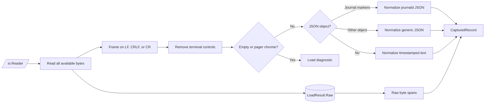
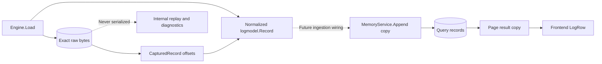

# Parser engine

Status: implemented and tested; not connected to runtime stdin or file input.

## Flow

`parse.NewEngine(Options).Load(io.Reader)` reads the available input into one
`LoadResult`. The original bytes are stored once; normalized records point back
to them with exclusive `RawStart` and `RawEnd` offsets.

Detection is per record, so terminal noise or one malformed line does not lock
the rest of the input to the wrong parser. JSON-looking data that fails decoding
is retained as text with a diagnostic.

## Normalized record

`logmodel.Record` is the shared parser/query shape:

| Field | Current rule |
| --- | --- |
| `timestamp` | RFC3339Nano UTC; omitted when no supported timestamp is found |
| `severity` | `debug`, `info`, `warn`, `error`, or `fatal` |
| `message` | Clean display text; a recognized text timestamp prefix is removed |
| `fields` | Complete cleaned JSON object using JSON-compatible value types |
| `sourceFormat` | `journald-json`, `json`, or `text` |
| `diagnostics` | Stable codes for non-fatal cleanup or fallback decisions |

Journald recognition requires `__REALTIME_TIMESTAMP` plus a cursor,
monotonic timestamp, or boot ID. It uses `MESSAGE`, maps `PRIORITY`, and
prefers `_SOURCE_REALTIME_TIMESTAMP` over `__REALTIME_TIMESTAMP`. Generic
JSON checks `message/msg/log`, `severity/level/lvl/priority`, and
`timestamp/time/ts/@timestamp`. Plain text recognizes RFC3339,
`YYYY-MM-DD HH:mm:ss`, and syslog month/day timestamps. Nested JSON or logfmt
inside a message is intentionally not parsed again.

## Decision ledger

| Revisitable decision | Implemented in | Revisit when |
| --- | --- | --- |
| Read the source fully into memory and retain exact bytes | `Engine.Load`, `LoadResult` in [engine.go](../internal/parse/engine.go) | Streaming capture, input limits, or disk spill are introduced |
| Treat LF, CRLF, lone CR, and a final unterminated line as record boundaries | `splitFrames` in [engine.go](../internal/parse/engine.go) | Multiline records or terminal screen replay are added |
| Strip ANSI/ECMA-48 and unsafe C0/C1 controls with a state machine | `sanitizeBytes` in [sanitize.go](../internal/parse/sanitize.go) | Styled output should be preserved or more terminal protocols are supported |
| Drop only styled `less` filler/status lines; retain uncertain content | `isPagerArtifact`, `hasLessTruncation` in [sanitize.go](../internal/parse/sanitize.go) | Other pagers need explicit artifact rules |
| Detect each record as journald JSON, generic JSON, then text | `parseRecord`, `looksLikeJournald` in [normalize.go](../internal/parse/normalize.go) | A parser registry, confidence scoring, or more formats are added |
| Preserve structured JSON types with `json.Number` in Go | `decodeJSON`, `cleanJSONValue` in [normalize.go](../internal/parse/normalize.go) | Exact numeric spelling must cross the browser boundary |
| Prefer source time, fall back to journal receipt time, and map syslog priority | `normalizeJournald` in [normalize.go](../internal/parse/normalize.go) | Receipt-time ordering or all eight syslog levels are required |
| Use configurable timezone/reference context for incomplete text timestamps | `parseLeadingTimestamp` in [timestamp.go](../internal/parse/timestamp.go) | Input-specific timezone/year controls are exposed |
| Keep raw bytes internal while exposing format and diagnostics on rows | [model.go](../internal/logmodel/model.go), [types.ts](../web/src/lib/transport/types.ts) | A raw-record detail endpoint is designed |
| Deep-copy nested fields at query append and page boundaries | `CloneRecord` in [model.go](../internal/logmodel/model.go), `Append` and `Page` in [memory.go](../internal/query/memory.go) | Records become immutable value objects or storage ownership changes |

Common diagnostic codes are
`terminal_controls_removed`, `terminal_artifact_skipped`,
`terminal_truncated`, `invalid_utf8_replaced`,
`malformed_json_fallback`, `timestamp_context_assumed`,
`invalid_timestamp`, `missing_message`, `non_text_message`,
`invalid_severity`, and `multiple_journal_values`.

## Boundaries and verification

- No call from `cmd/streamline` to the parser exists yet. Future ingestion
  should convert `CapturedRecord.Entry` values into complete append batches.
- Pretty/multiline JSON, journal export format, stack-trace grouping, and nested
  message parsing are out of scope.
- [engine_test.go](../internal/parse/engine_test.go) covers the committed fixture,
  mixed formats, terminal cleanup, time context, malformed input, raw spans,
  long lines, partial reader failures, and the supplied local datasets when
  present.
- Query/API/frontend tests cover typed-field transport and defensive copying.
