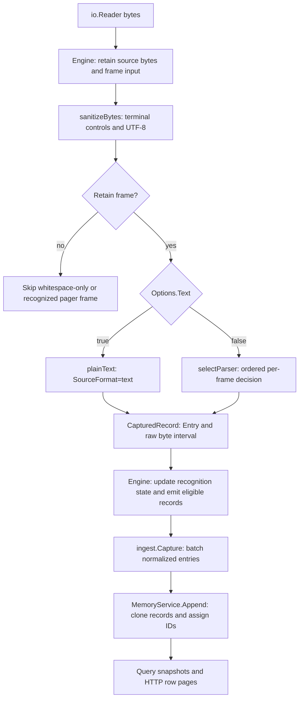
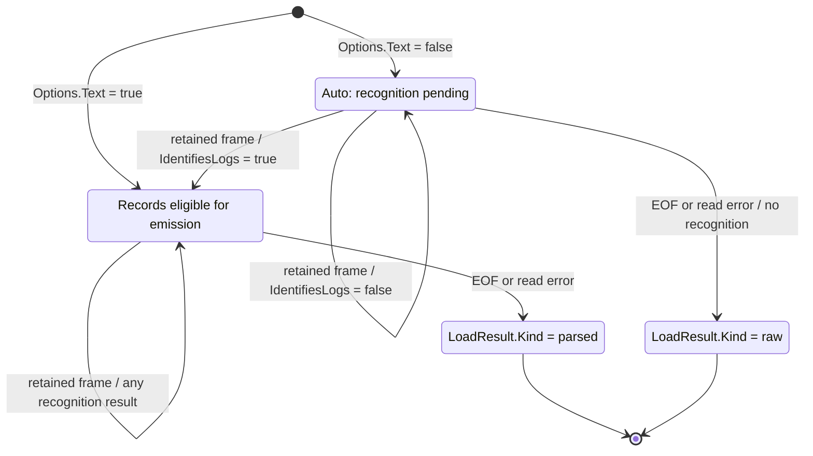
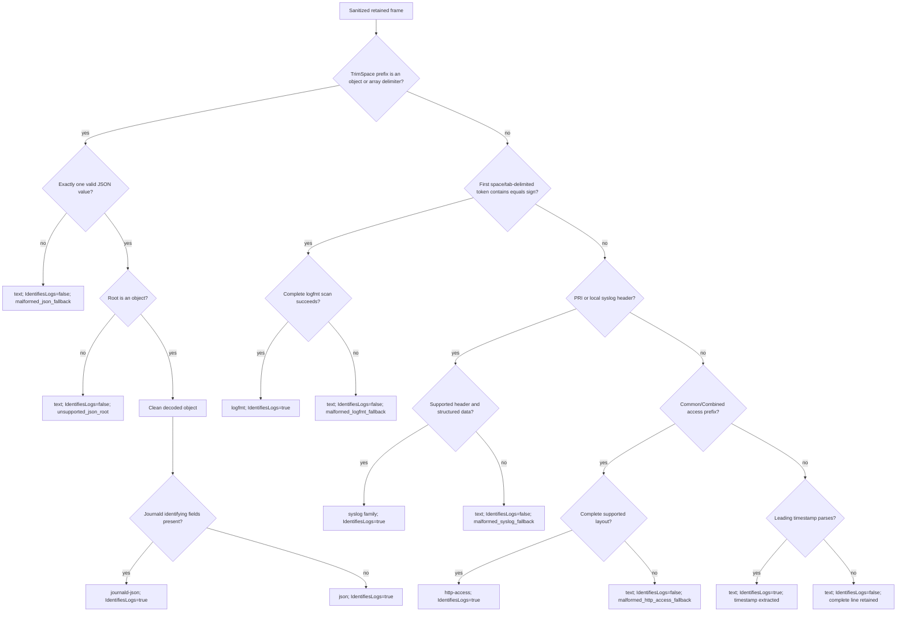
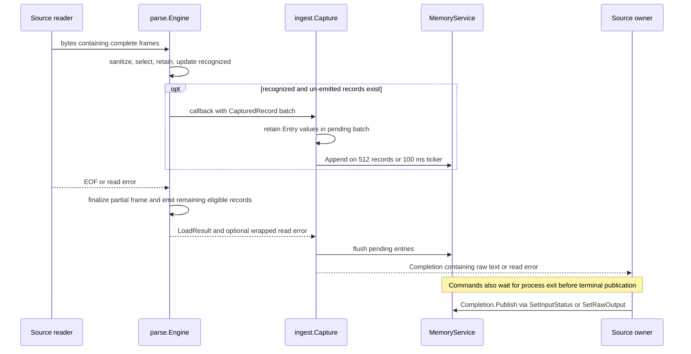

# Parser modes and decision architecture

This document specifies the implemented behavior of `internal/parse` and its
integration with `internal/ingest`, `internal/source`, and `internal/query`.
The configuration, classification, provenance, and completion domains below
are independent; their values are not interchangeable.

## Start here

Auto detection uses the contents of each sanitized physical line. It does not
inspect the filename, command name, file extension, or which service produced
the bytes. Stdin and command sources use the same detection path.

For each retained line, the engine selects one parser, creates a normalized
record, and asks whether that line identifies the input as logs. One recognizing
line starts publication of all buffered records; subsequent lines are still
detected independently. Text mode skips detection and publishes literal
sanitized lines.

- [Execution stages](#execution-stages-and-ownership): framing, cleanup, parsing,
  and publication.
- [Selection order](#parser-selection-and-extension): exact recognition predicates
  and the decision diagram.
- [Detection examples](#detection-examples): successful matches, rejected
  candidates, and timestamped text.
- [Normalization](#normalized-record-contract): timestamps, severity, messages,
  and source-field types.
- [Troubleshooting](#troubleshooting-detection): explain raw output, missing
  fields, and apparently delayed records.
- [Extension requirements](#extension-requirements): how to add another parser.

## Decision domains

| Domain | Scope and owner | Values | Function |
| --- | --- | --- | --- |
| Configured mode | One source invocation; source manager | `auto`, `text` | Selects whether format recognition executes |
| Parser option | One immutable `Engine`; `parse.Options.Text` | `false`, `true` | Internal representation of Auto and Text |
| Recognition decision | One retained frame; `selectParser` | `parseDecision{Record, IdentifiesLogs}` | Produces a record and determines whether it constitutes evidence for structured stream output |
| Stream classification | One `Engine.Stream` invocation; `recognized` | `false`, `true` | Controls callback eligibility and final result variant; transition is monotonic |
| Record provenance | One `logmodel.Record`; `SourceFormat` | `journald-json`, `json`, `logfmt`, `syslog-rfc5424`, `syslog-rfc3164`, `syslog-text`, `http-access`, `text` | Identifies the normalization path |
| Parser result variant | One completed load; `LoadResult.Kind` | `parsed`, `raw` | Selects `ParsedResult` or `RawResult` |
| Query input kind | One source query service; `Session.InputKind` | `pending`, `records`, `raw` | Identifies the representation currently available to transport consumers |
| Terminal input status | One source query service; `Session.InputStatus` | `streaming`, `eof`, `error` | Reports producer completion independently of representation |

`SourceFormat=text` does not imply configured Text mode or a raw result. It can
represent forced text, recognized timestamped text, or an unrecognized frame
retained within a parsed stream. `ResultRaw` is a terminal representation, not a
selectable parser. Process lifecycle states such as `running`, `failed`, and
`stopped` belong to the [source manager](command-sources.md#completion-and-cleanup).

## Configured modes

| Property | Auto | Text |
| --- | --- | --- |
| Engine construction | `Options{Text: false}`; zero-value default | `Options{Text: true}` |
| Initial `recognized` value | `false` | `true` |
| Format selection | `selectParser` executes for each retained frame | Selector is bypassed; `plainText` executes |
| Record contents | Format-specific normalization or text fallback | Sanitized line in `Message`; `SourceFormat=text`; no fields, timestamp, or severity |
| Callback eligibility | Begins after the first recognizing frame | Begins with the first retained complete frame |
| Unrecognized prefix | Buffered records; emitted in input order after recognition | No recognition buffer delay |
| Final result | `parsed` if any frame recognizes logs; otherwise `raw` | `parsed`, including an empty record set |
| Diagnostics | Cleanup, recognition, and normalization diagnostics | Cleanup and truncation diagnostics only |

The command source API defaults an omitted or empty mode to `auto`, validates
`auto` or `text`, and rejects other values with `invalid_mode`. The command
runner maps `mode == "text"` to `Options.Text`. Stdin uses `Options{}` and
therefore Auto. There is no runtime source-mode mutation or individual-format
override. Saved configurations persist the source mode; loading a configuration
prepares a subsequent run without reclassifying an existing source.

"Callback eligibility" refers to `Engine.Stream`. It is not a synchronous UI
publication guarantee: framing requires a complete line or terminal partial line,
and ingestion applies an additional batching interval.

## Execution stages and ownership



| Owner | Implementation | Contract |
| --- | --- | --- |
| Stream mechanics | [engine.go](../internal/parse/engine.go) | Reads bytes; retains source; frames, sanitizes, filters frames; updates recognition state; emits records; selects final result |
| Format selection | [selector.go](../internal/parse/selector.go) | Owns ordered recognition and `parseDecision`; has no stream or process state |
| JSON decoding | [json.go](../internal/parse/json.go) | Decodes exactly one JSON value with `json.Number`; invokes shared field normalization |
| Journald interpretation | [journald.go](../internal/parse/journald.go) | Recognizes journal field structure and normalizes journal-specific values |
| Logfmt decoding | [logfmt.go](../internal/parse/logfmt.go) | Scans a complete key/value line; preserves string values; invokes shared field normalization |
| Syslog decoding | [syslog.go](../internal/parse/syslog.go) | Recognizes RFC 5424, traditional PRI-prefixed syslog, and local timestamp/host/tag layouts |
| HTTP access decoding | [http_access.go](../internal/parse/http_access.go) | Recognizes exact Common/Combined layouts and extracts numeric response fields |
| Text interpretation | [text.go](../internal/parse/text.go) | Extracts a leading timestamp or preserves the complete sanitized line |
| Common normalization | [normalize.go](../internal/parse/normalize.go) | Cleans decoded JSON values and applies shared canonical-field aliases |
| Shared primitives | [timestamp.go](../internal/parse/timestamp.go), [severity.go](../internal/parse/severity.go), [diagnostic.go](../internal/parse/diagnostic.go), [sanitize.go](../internal/parse/sanitize.go) | Timestamp context, severity mappings, diagnostic deduplication, terminal and UTF-8 handling |
| Publication | [stdin.go](../internal/ingest/stdin.go) | Batches entries and separates capture completion from terminal status publication |

Framing recognizes LF, CRLF, lone CR, and a final unterminated line. A CR at a
read boundary is deferred until the next byte or terminal read establishes
whether a following LF belongs to the same delimiter. A single read can contain
multiple frames; a frame can span multiple reads. There is no scanner token-size
limit. Escaped newlines decoded inside structured values do not create frames.

Sanitization occurs before selection. Valid UTF-8 sequences are consumed as
complete runes so continuation bytes are not interpreted as C1 controls.
Decoded structured strings are sanitized again after unescaping. Whitespace-only
frames are omitted. Recognized pager filler/status frames are omitted only when
terminal controls were present. Exact input bytes are retained independently of
these transformations.

## Stream classification state machine

For retained frame `i`, define `d_i = parseDecision.IdentifiesLogs`. The engine
uses the recurrence `r_0 = Options.Text`, `r_i = r_(i-1) OR d_i`. Skipped frames
do not change `r`. Once `r` becomes true, subsequent record-level failures cannot
return the stream to raw eligibility. Text mode retains `r=true` without calling
the selector.



The terminal transitions occur after processing the final partial frame, if any.
While pending, the engine buffers normalized fallback records without invoking
the callback. On recognition, the next emission includes every un-emitted
record, including the prefix, in input order. Later fallback records remain
eligible for emission. `emitReady` executes after processing available frames
from each read that supplies bytes and after terminal framing. `Load(reader)` uses the
same path with a nil callback and returns the complete result.

At completion, exactly one result pointer is non-nil:

| Final classification | Result invariant |
| --- | --- |
| `recognized=true` | `Kind=parsed`, `Parsed!=nil`, `Raw=nil` |
| `recognized=false` | `Kind=raw`, `Raw!=nil`, `Parsed=nil` |

`Source` contains all bytes read in both variants. Raw output is generated by
sanitizing the complete source again with newline preservation. It is not a
concatenation of retained text records: whitespace-only frames and sanitized
pager text can consequently remain in the raw representation. Auto with empty
input returns raw text of length zero; Text with empty input returns zero records.

## Parser selection and extension

The selector executes the following exclusive branches. It never fixes one
parser for the entire source and performs no recursive parsing of message values.



1. **JSON branch:** `strings.TrimSpace(input)` starts with `{` or `[`. Decode
   once, require EOF after the first value, and require an object root. Failed
   JSON candidates return immediately; they are never offered to logfmt.
2. **Journald specialization:** the cleaned object contains
   `__REALTIME_TIMESTAMP` and at least one of `__CURSOR`,
   `__MONOTONIC_TIMESTAMP`, or `_BOOT_ID`. Recognition checks field presence;
   invalid timestamp/message values do not revoke recognition. Other objects
   use generic JSON, including objects with no known canonical fields.
3. **Logfmt branch:** trim only leading/trailing spaces and tabs. If the first
   space/tab-delimited token contains `=`, scan the entire line. Success
   recognizes logs without requiring timestamp, severity, or message fields.
   Failure returns the complete sanitized input as text and discards partial
   fields and scan diagnostics. Timestamp recognition is not attempted afterward.
4. **Syslog branch:** recognize PRI-prefixed RFC 5424/3164 or a supported local
   timestamp/hostname/tag layout. Structural failures in PRI candidates retain
   whole-line text with diagnostics. Valid headers identify logs even if the
   timestamp is absent or invalid.
5. **HTTP access branch:** recognize a Common/Combined prefix and require the
   complete layout. Malformed candidates retain whole-line text and do not
   identify logs. Invalid dates in valid layouts produce normalization diagnostics.
6. **Text branch:** `normalizeText` attempts a leading timestamp after removing
   leading spaces/tabs. Success removes the timestamp prefix from `Message` and
   recognizes logs. Failure preserves the complete sanitized input as text.

### Candidate selection versus log recognition

Syslog and HTTP access return `(parseDecision, candidate)`. These values answer
different questions:

| Result | Selector action | Effect on stream recognition |
| --- | --- | --- |
| `candidate=false` | Try the next parser | None yet |
| `candidate=true, IdentifiesLogs=false` | Return the candidate's text fallback; stop trying parsers | Does not establish parsed output |
| `candidate=true, IdentifiesLogs=true` | Return the normalized record; stop trying parsers | Establishes parsed output |

JSON and logfmt express the same distinction through their exclusive branches.
A failed candidate is not an invitation to search inside the line for another
format. For example, malformed JSON followed by `msg=hello` stays a JSON
failure rather than becoming logfmt.

Normalization diagnostics are separate from recognition. A valid object with
no message, RFC 5424 with a NIL timestamp, or an access record with a
syntactically located but invalid date can identify logs. None needs a valid
timestamp, severity, and message simultaneously.

### Detection examples

Each example is one input line in Auto mode. “Recognizes” means
`IdentifiesLogs`, not whether a row will eventually be visible: an unrecognized
line still becomes a row if another line establishes parsed output.

| Input | Source format | Recognizes | Explanation |
| --- | --- | --- | --- |
| `{"MESSAGE":"ready","__REALTIME_TIMESTAMP":"0","__CURSOR":"c"}` | `journald-json` | Yes | Journal keys select the specialization; timestamp is the Unix epoch |
| `{"MESSAGE":"ready"}` | `json` | Yes | Uppercase MESSAGE alone is not journal evidence or a generic message alias |
| `{}` | `json` | Yes | Any valid object qualifies; normalization adds `missing_message` |
| `{"msg":broken} msg=hello` | `text` | No | Exclusive JSON candidate fails with `malformed_json_fallback` |
| `[{"message":"ready"}]` | `text` | No | Arrays are rejected with `unsupported_json_root` |
| `status=503` | `logfmt` | Yes | Complete key/value syntax qualifies; status remains a string |
| `msg="unfinished` | `text` | No | Incomplete quoting produces `malformed_logfmt_fallback` |
| `<35>1 - home sshd 42 AUTH - denied` | `syslog-rfc5424` | Yes | Version 1; missing timestamp is allowed; severity is error |
| `<35>Sep 10 12:00:00 home sshd[42]: denied` | `syslog-rfc3164` | Yes | PRI plus traditional timestamp and host/tag; year and zone inferred |
| `Sep 10 12:00:00 home sshd[42]: denied` | `syslog-text` | Yes | No PRI; host/app/process extracted; severity remains empty |
| `<999>1 - home app - - - message` | `text` | No | Invalid PRI produces `malformed_syslog_fallback` |
| `192.0.2.1 - - [10/Sep/2026:12:00:00 +0000] "GET / HTTP/1.1" 503 12` | `http-access` | Yes | Common layout; numeric status and bytes; no inferred severity |
| `2026-09-10T12:00:00Z {"message":"ready"}` | `text` | Yes | Leading timestamp is removed; embedded JSON remains message text |
| `Sep 10 12:00:00 sshd[42]: denied` | `text` | Yes | Hostless line fails local syslog recognition, then qualifies as timestamped text |
| `ordinary prose mentioning status=503` | `text` | No | Key/value text does not begin the line |

Common becomes Combined only when both quoted referer and user-agent fields
follow the byte count. Adding an extra duration field to either layout produces
a whole-line `malformed_http_access_fallback`. A custom prefix that prevents
the access-header match instead reaches the ordinary fallback.

### Worked mixed-stream example

Suppose these four lines arrive while the source is still open:

```text
waiting for service
<999>bad
<35>1 - home sshd 42 AUTH - denied
2026-09-10T12:00:00Z {"message":"ready"}
```

The first two complete lines are buffered. The third line recognizes RFC 5424,
so the next parser callback includes those two text records followed by the
syslog record. The malformed second record keeps its diagnostic. The fourth
line is independently recognized as timestamped text, with JSON-looking content
left in its message. Input order and exact raw intervals are preserved.

If the source instead ends after line two, the result is raw text and the
buffered per-record diagnostics are not exposed. If the same input is run in
Text mode, each complete retained line is eligible for publication immediately,
with no parser fields or parser diagnostics. Ingestion batching still applies
in all parsed cases.

### Extension requirements

1. Define the new format's recognition predicate, decoding failure semantics,
   normalization rules, and precedence relative to existing formats.
2. Implement format-specific behavior in a named file and add an explicit branch
   to `selectParser`; keep read loops, offsets, and publication outside the parser.
3. Return `parseDecision` with recognition evidence independent of normalization
   diagnostics. Reuse common helpers only where the source semantics match.
4. For a new provenance value, update Go `SourceFormat` and the TypeScript
   `SourceFormat` union. Do not add a source mode unless explicit user selection
   is required; source modes and parser formats are different contracts.
5. Add precedence, negative-recognition, malformed-input, mixed-format, streaming,
   raw-offset, and transport tests. Update this specification and its diagrams.

## Normalized record contract

| Field | Contract |
| --- | --- |
| `Timestamp` | RFC3339Nano in UTC; empty when normalization finds no valid timestamp |
| `Severity` | `debug`, `info`, `warn`, `error`, `fatal`, or empty |
| `Message` | Sanitized source string, timestamp-stripped text, or compact structured fallback |
| `Fields` | Cleaned source object for JSON/logfmt, or extracted fields for syslog/access; JSON types are preserved, logfmt values stay strings, and format-defined numbers use `json.Number` |
| `SourceFormat` | Selected normalization family; independent of configured source mode |
| `Diagnostics` | Deduplicated by code within a record; nonfatal |
| `MessageIsJSON` | Internal flag for serialized display fallbacks; excluded from JSON transport |

Generic JSON and logfmt use `normalizeFields` with the following precedence:

| Canonical value | Ordered aliases | Selection semantics |
| --- | --- | --- |
| Message | `message`, `msg`, `log` | First present non-null value; empty strings are valid; non-string JSON values are serialized with `non_text_message` |
| Severity | `severity`, `level`, `lvl`, `priority` | First recognized value; invalid candidates add `invalid_severity` and allow later aliases |
| Timestamp | `timestamp`, `time`, `ts`, `@timestamp` | First valid value; invalid candidates add `invalid_timestamp` and allow later aliases |

Absent message aliases produce compact serialization of the complete field map,
`missing_message`, and `MessageIsJSON=true`. Search then traverses original field
values instead of matching serialized keys. Actual string messages remain
searchable even when their content resembles JSON or logfmt.

JSON numeric `priority` accepts severity codes 0–7, not the packed 0–191 PRI
used in a syslog envelope. Journald `PRIORITY` also uses 0–7. Their shared mapping
is 0–2 → `fatal`, 3 → `error`, 4 → `warn`, 5–6 → `info`, and 7 → `debug`.
Only the syslog envelope parser derives a severity code using PRI modulo 8.
JSON numeric `ts` values support Unix seconds. String timestamps use the shared timestamp parser.
Numeric-looking logfmt strings are not converted to numeric timestamps,
priorities, booleans, nulls, or numeric filter operands.

Journald uses `MESSAGE`, maps `PRIORITY`, and tries `_SOURCE_REALTIME_TIMESTAMP`
before `__REALTIME_TIMESTAMP`. Journal timestamps are integer microseconds since
the Unix epoch. `MESSAGE` supports text and byte arrays; repeated journal values
select the first usable value and can produce `multiple_journal_values`.
An unusable or missing message produces a compact object fallback.

Text timestamps support calendar timestamps with optional fractional seconds and
timezone, plus syslog month/day/time prefixes. Missing zones use
`Options.DefaultLocation` (UTC by default). Missing years select the closest
valid candidate from the reference year and its adjacent years.
`Options.ReferenceTime` defaults to the time at stream initialization. Inferred
context produces `timestamp_context_assumed`. These options are internal engine
configuration; the source API does not expose them.

## Logfmt rules

CrowdSec's `time="…" level=info msg="…"` output uses the general `logfmt` parser.
It accepts one or more complete `key=value` pairs separated by spaces or tabs,
without requiring a known field or timestamp. A complete `status=403` line therefore sets
`parseDecision.IdentifiesLogs=true` in Auto mode.

- Keys are nonempty and unquoted, with no space, tab, double quote, or equals sign.
  Keys stay literal; dots do not create nested objects. Existing column/filter
  paths still traverse objects and do not gain literal dotted-key lookup.
- Values are empty, unquoted, or double quoted. Unquoted values may contain `=`;
  double quotes must enclose the whole value and be followed by a separator or EOF.
  Double-quoted values use Go string escaping via `strconv.Unquote`, compatible
  with [Logrus text quoting](https://github.com/sirupsen/logrus/blob/master/text_formatter.go).
  Single quotes and backticks have no quoting semantics; they are literal
  unquoted characters. Bare keys without `=` are rejected.
- All values remain strings, including `403`, `true`, and `null`. Numeric filters
  continue to require numeric source fields and do not coerce these strings.
  Numeric `ts`/`priority` JSON behavior therefore does not apply to logfmt strings.
- Normalization shares JSON's alias order. A valid message alias may be empty;
  absent messages use a compact object display fallback with `missing_message`
  and `MessageIsJSON`, so general search visits values rather than object keys.
  Invalid timestamps/severities retain source values and existing diagnostics.
- The last duplicate key wins with `duplicate_logfmt_key`. A leading token
  containing `=` selects a candidate; scanning must consume the entire line.
  Malformed candidates return whole sanitized text, discard partial fields and
  their diagnostics, and add `malformed_logfmt_fallback` with a one-based byte
  position in the trimmed, sanitized line. They do not identify the source as logs.
- Values are sanitized after unquoting, preserving Unicode and escaped newlines
  while removing terminal controls. Exact source bytes and physical line framing
  are unchanged. Embedded messages are not recursively parsed.

For `time="2026-01-03T18:07:22+02:00" level=warning msg="blocked" module=db`,
the canonical values are `timestamp=2026-01-03T16:07:22Z`, `severity=warn`, and
`message=blocked`; `fields` retains all four original string values.

## Syslog and HTTP access rules

### Syslog

`syslog.go` recognizes a PRI candidate when the sanitized line, after leading
space/tab removal, starts with `<` followed by a decimal digit. PRI must be
0–191 with at most three digits and no leading zero except `0`. A digit after
PRI selects the RFC 5424 path; only version 1 is supported. Otherwise the
timestamp must use the traditional month/day/time syntax.

- RFC 5424 requires its six header tokens, separated by single ASCII spaces,
  followed by structured data or NILVALUE and an optional space/message.
  Header token lengths follow the RFC. Missing values become null.
- Structured data becomes an object keyed by SD-ID, containing parameter maps.
  Duplicate element IDs are malformed. Repeated parameter names become arrays.
  Quote, backslash, and closing-bracket escapes are decoded; unknown escapes
  retain the original backslash. Decoded values pass through common cleanup.
- Without PRI, supported local layouts are a month/day/time or calendar/ISO
  timestamp followed by a hostname and `app:` or `app[decimal-pid]:`. Host and
  app are required; timestamped prose and hostless output remain text.
  Local host tokens allow ASCII letters/digits, underscore, dot, colon, and
  hyphen; app tokens additionally allow slash and at-sign but no colon.
- `Fields` contains `time`, `hostname`, `app`, and `procid`. RFC 5424 adds
  numeric `version`, string-or-null `msgid`, and object-or-null
  `structured_data`. PRI adds numeric
  `priority`, `facility=PRI/8`, and `severity_code=PRI%8`. Process IDs stay
  strings; absent process IDs are null.
- Canonical severity uses `severity_code`; it remains empty without PRI.
  Message is the payload after the header delimiter; its whitespace is retained.
  An RFC 5424 message's initial UTF-8 BOM is excluded from the display message.
- RFC 5424 timestamps require uppercase T/Z, a zone, and at most six fractional
  digits. A NIL timestamp produces no diagnostic. Invalid dates retain fields
  with `invalid_timestamp`. Local and legacy timestamps reuse configured
  year/timezone inference and `timestamp_context_assumed`.
- Provenance is `syslog-rfc5424`, `syslog-rfc3164` (PRI plus traditional
  timestamp/tag), or `syslog-text` (no PRI). Unsupported headers or malformed
  structured data in PRI candidates use `malformed_syslog_fallback`, preserving
  the whole line without recognition. No payload is recursively parsed.

### HTTP access

`http_access.go` requires three unquoted fields followed by a bracketed
day/month/year access timestamp. The complete remainder must match Common
(quoted request, status, bytes) or Combined (plus quoted referer and user agent).
Leading indentation and space/tab field separators are accepted; extra fields,
custom prefixes/order, and unsupported quote escapes are rejected.

- `Fields` exposes `client`, `ident`, `user`, `time`, `request`, `status`,
  and `bytes`; Combined adds `referer` and `user_agent`. Missing markers become
  null except the request, whose literal `"-"` is retained.
- Status is a three-digit number in 100–599. Bytes is an unsigned 64-bit decimal,
  normalized without leading zeros. Both use `json.Number`, enabling existing
  numeric filtering; JSON and logfmt type rules remain unchanged.
- Apache C-style/quote/backslash and Nginx/Apache hex-byte escapes are decoded
  before cleanup. Request targets are not URL-decoded. A valid three-part
  request adds `method`, `target`, and `protocol`; malformed client requests
  remain valid log entries without these derived fields.
- Canonical message is the decoded request; severity remains empty. A valid
  access timestamp becomes UTC. A structurally valid record with an invalid
  date/zone retains fields with `invalid_timestamp` and no canonical timestamp.
- Recognized malformed layouts use `malformed_http_access_fallback`, preserve
  the full sanitized line, discard partial fields, and do not identify logs.
  Headers that do not resemble this layout simply reach the existing fallback.

See [runnable examples and field reference](../examples/README.md) for all four
provenance values, saved filters, source commands, timestamp limitations, and
links to upstream format specifications.

## Capture, publication, and terminal status



`Engine.Stream` has no context parameter. It returns a partial result plus a
wrapped error for a non-EOF read failure and adds `input_read_error` at
`[len(Source), len(Source))`. Bytes returned together with a read error are
processed before completion. `ingest.Capture` adds cancellation and batching;
source owners must close blocking readers when interruption is required.

`Capture` forwards `Entry` values, flushes batches of 512 records, and flushes a
partial batch on its 100 ms ticker or completion. These are publication
thresholds, not strict scheduling deadlines or memory-retention limits.
`MemoryService.Append` clones records, assigns source-local IDs, and changes a
pending query input kind to `records` on a nonempty append. Parser recognition
can therefore precede the corresponding query/session transition.

`Completion.Publish` selects terminal `eof` or `error` independently of whether
the result contains records or raw text. A supplied source/process error takes
precedence over the captured read error. `SetRawOutput` publishes terminal raw
text as UTF-8-boundary-safe chunks of at most 64 KiB and sets `InputKind=raw`.
For parsed output it calls `SetInputStatus`. If no records were appended, that
method changes `pending` to `records` on `eof` only; an empty Text capture ending
in a read error can consequently remain `InputKind=pending, InputStatus=error`.

For commands, capture EOF does not determine process success. The source owner
waits for capture and process completion before publishing final state. Intentional
Stop and process-exit error policies are specified in
[command-source completion](command-sources.md#completion-and-cleanup).
HTTP row/raw endpoints transfer content; SSE transfers state notifications only.

## Provenance and diagnostic boundaries

| Evidence | Owner and scope | Availability |
| --- | --- | --- |
| Exact bytes | `LoadResult.Source` | Returned by `Engine.Load`/`Stream`; retained during that invocation |
| Raw interval | `CapturedRecord.RawStart`, `RawEnd` | Half-open byte interval in `Source`, including the original delimiter when present |
| Parser identity | `Record.SourceFormat` | Retained by ingestion/query and included in HTTP rows |
| Record diagnostics | `Record.Diagnostics` | Retained for emitted records and included in HTTP rows |
| Skipped-frame diagnostics | `LoadResult.Diagnostics` | `terminal_artifact_skipped`, with the skipped interval; not forwarded by ingestion |
| Read failure | Returned error and `LoadDiagnostic` | Error translated into terminal input status; the full load-diagnostic list is not transported |

Raw intervals are not copied into query rows. `Capture` does not retain the
complete `LoadResult` after completion. Source replay, exact-byte retrieval, and
an HTTP parser trace are not implemented. Raw fallback preserves display-safe
text, not exact source bytes.

When a source ends as raw, buffered fallback records are omitted from the result;
their per-record diagnostics are not promoted to `LoadResult.Diagnostics`.
A malformed logfmt line therefore exposes `malformed_logfmt_fallback` in a row
only when another frame has recognized the source as parsed output. Cleanup
codes can also occur in Text mode; parser-specific codes cannot.

| Decision or transformation | Diagnostic code |
| --- | --- |
| Terminal controls removed from a retained line or decoded value | `terminal_controls_removed` |
| Invalid UTF-8 replaced | `invalid_utf8_replaced` |
| Recognized terminal-only/pager frame omitted | `terminal_artifact_skipped` |
| Pager truncation marker detected | `terminal_truncated` |
| JSON-shaped line cannot decode as one complete value | `malformed_json_fallback` |
| Valid JSON root is not an object | `unsupported_json_root` |
| Complete logfmt candidate cannot be scanned | `malformed_logfmt_fallback` |
| Malformed or unsupported PRI syslog candidate | `malformed_syslog_fallback` |
| Malformed or unsupported Common/Combined candidate | `malformed_http_access_fallback` |
| Repeated logfmt key; final value retained | `duplicate_logfmt_key` |
| JSON key cleanup merges distinct source keys | `field_key_collision` |
| Missing message / unusable or non-string message | `missing_message`, `non_text_message` |
| Invalid canonical timestamp or severity candidate | `invalid_timestamp`, `invalid_severity` |
| Timestamp requires configured year or timezone context | `timestamp_context_assumed` |
| Journal field has multiple values | `multiple_journal_values` |
| Reader returns a non-EOF error | `input_read_error` |

Logfmt diagnostic byte positions are one-based offsets in the space/tab-trimmed,
sanitized candidate. They are not offsets into `LoadResult.Source`; terminal
cleanup can change byte lengths. Use `CapturedRecord` intervals for exact-byte
correlation at the parser boundary.

## Troubleshooting detection

| Observation | Explanation and next check |
| --- | --- |
| Auto shows no rows while a command runs | No complete recognizing frame may have arrived. Check the final newline and child buffering; try a new Text-mode run for immediate line display. A format name in the command does not select a parser. |
| A `.json` file is shown as raw | Detection ignores extensions. Check for object-per-line output, array roots, pretty-printed multiline JSON, or prefixes before the object. |
| A line beginning with a bracketed timestamp is not parsed as a text log | A leading `[` claims the JSON branch first. Invalid JSON is not offered to timestamp/syslog detection afterward. |
| Timestamp appears, but app or request fields are absent | The record may be timestamped `text`. Syslog needs the supported host/tag header; access logs need the exact Common/Combined layout. |
| Docker/Compose JSON appears as message text | Timestamp/container prefixes can hide the JSON prefix. The parser does not unwrap them or recursively parse a `log`/`message` value. Use unprefixed structured producer output when possible. |
| HTTP 503 or an “error” message has no severity | HTTP and unprioritized local syslog do not infer severity from status or prose. Filter HTTP `status` numerically; filter message text for prose. |
| Numeric filtering matches HTTP status but not `status=503` | Access status is numeric; logfmt status is a string. Use a string operator for the latter. |
| Old syslog dates appear in the wrong year or zone | Missing context uses UTC and a year near source startup. `timestamp_context_assumed` records the inference; timezone/reference options are currently internal. |
| Malformed line has no visible diagnostic in raw output | Per-record diagnostics are published only in a parsed stream. Raw fallback exposes sanitized source text, not buffered records. |
| Loading a saved configuration does not reinterpret existing logs | Saved mode prepares a future invocation. Start a new run; an existing source has no parser override or reclassification operation. |

Inspect `sourceFormat`, `fields`, and `diagnostics` on HTTP query rows to
distinguish detection from display/column issues. Parser-level tests also expose
`IdentifiesLogs` and raw intervals, which are not HTTP row properties.
Command-source lifecycle problems are covered separately in
[command-source debugging](command-sources.md#debugging-and-verification).

## Architectural invariants and verification

| Invariant | Primary evidence |
| --- | --- |
| Source mode is distinct from per-record format | [selector tests](../internal/parse/selector_test.go) |
| Auto classification is monotonic; mixed formats preserve order | [engine tests](../internal/parse/engine_test.go), [selector tests](../internal/parse/selector_test.go) |
| Text bypasses selection and emits sanitized records before EOF | [engine tests](../internal/parse/engine_test.go), [selector tests](../internal/parse/selector_test.go) |
| Malformed structured candidates retain the full sanitized line | [logfmt tests](../internal/parse/logfmt_test.go), [engine tests](../internal/parse/engine_test.go) |
| Framing and normalization preserve raw byte intervals | [logfmt tests](../internal/parse/logfmt_test.go), [engine tests](../internal/parse/engine_test.go) |
| UTF-8 continuation bytes do not become terminal commands | [sanitizer tests](../internal/parse/sanitize_test.go) |
| Recognition enables publication before source completion | [ingestion tests](../internal/ingest/stdin_test.go) |
| String-valued fields and provenance survive query/HTTP transport | [logfmt HTTP tests](../internal/httpapi/logfmt_test.go) |
| Syslog/access fields and provenance survive command sources and HTTP numeric/text filters | [HTTP tests](../internal/httpapi/builtin_parsers_test.go), [command tests](../internal/source/builtin_parsers_test.go) |
| New formats preserve streaming, offsets, and forced Text mode | [stream tests](../internal/parse/builtin_stream_test.go) |
| Saved parser examples validate and select the intended sample records | [configuration tests](../internal/configuration/parser_examples_test.go) |
| Canonical and source fields remain selectable as columns | [column tests](../web/tests/columns.test.ts) |

The committed [CrowdSec fixture](../internal/parse/testdata/crowdsec.json) contains
18 field combinations and escaped values. The optional full local dataset is
checked against its current 136,232 records. `make check` runs frontend checks,
frontend tests, Go tests, Go vet, and formatting validation. Optional terminal
captures are checked for raw fallback and safe display without assuming that
every capture contains standalone pager frames; deterministic tests cover pager
diagnostics.

Multiline JSON, stack-trace grouping, journal export records, recursive message
parsing, per-format manual overrides, source replay, and bounded capture storage
are outside the implemented parser contract. Additions must preserve or explicitly
revise the decision domains and invariants above.
