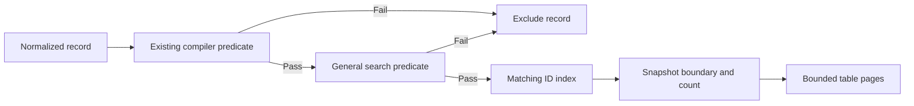

# General log search

Search is a query-scoped predicate over parsed log values. The browser owns
editing and syntax feedback; Go owns query acceptance and matching. Defaults
are Plain, OR, and case-insensitive. Search is session-local; raw output and
saved searches are excluded.

## Architecture

| Boundary | Implementation | Responsibility |
| --- | --- | --- |
| Editor | [SearchEditor.svelte](../web/src/lib/components/SearchEditor.svelte) | Draft options, confirmation, synchronized gutter, hover/focus errors. Mounted below the table for parsed records. |
| Frontend functions | [search.ts](../web/src/lib/search.ts) | Normalize lines, validate JS syntax, compare drafts, associate server errors. |
| Query lifecycle | [viewer-controller.ts](../web/src/lib/transport/viewer-controller.ts) | Copy confirmed options, manage replacement queries, reject stale responses, recover subscriptions. |
| Transport | [types.ts](../web/src/lib/transport/types.ts), [api.ts](../web/src/lib/transport/api.ts) | Carry query specifications and line errors over existing HTTP/SSE transport. |
| Search functions | [search.go](../internal/query/search.go) | Compile expressions, traverse scalar values, combine record predicates. |
| Backend lifecycle | [memory.go](../internal/query/memory.go) | Compose filters, scan records, maintain matching IDs and immutable snapshots. |



`MemoryService.Create` compiles existing filters and search before allocating a
query, then composes `allPredicates(existing, search)`. Initial scans,
concurrent-append catch-up, and live appends use that same predicate. Filtering
before indexing keeps counts and pages consistent with the complete result.

## Command and matching semantics

`POST /api/v1/queries` adds optional `search` alongside existing `filter` and `sort`:

```json
{"filter":"","sort":"input","search":{"text":"timeout\napi","mode":"plain","operator":"and"}}
```

- Modes: `plain` (default), `regexp`. Operators: `or` (default), `and`.
  Unknown values are rejected. The existing 64 KiB request-body limit applies.
- CRLF/CR normalize to LF. Blank lines are ignored; significant whitespace and
  original one-based line numbers are retained.
- Each line matches if any scalar in the entry matches. OR requires any matching
  line; AND requires every line to match within the same entry, potentially in
  different fields. Matches cannot span separate values or entries.
- Omitted or blank search is an identity predicate for either operator.
  Clearing search preserves the existing filter and sort.

Search visits normalized timestamp, severity, meaningful message, and recursive
`Fields` values, independent of visible columns. Strings use decoded text;
numbers retain `json.Number.String()`; booleans and null use JSON spelling.
Containers are traversed without serialization or concatenation. Keys, paths,
internal IDs, diagnostics, and source-format metadata are excluded.

[Parser normalization](../internal/parse/normalize.go) sets the internal
`Record.MessageIsJSON` flag when a display message is generated by serializing
structured or non-string data. Search excludes that generated string and visits
its original `Fields`, preventing property-name false positives. Real string
messages, including JSON-looking strings and decoded journald messages, remain
searchable. The provenance flag is not serialized.

## Validation boundary

Frontend regexp validation constructs `new RegExp(line, 'iu')` inside `try/catch`
for every active line on edits and confirmation. It never executes expressions
against browser logs. Plain mode bypasses syntax checks.

Go compiles all active lines once per query. Plain expressions first pass through
`regexp.QuoteMeta`; both modes prepend `(?i)` for default case folding. Regexp
flags can override defaults where accepted. Enter raw patterns without
`/.../flags` delimiters, for example `timeout|refused` or `status=[45][0-9]{2}`.

Native validation avoids WASM, workers, dependencies, and build changes. The
tradeoff is separate syntax acceptance: JS-valid lookaround/backreferences can
fail on Apply, and Go-only syntax can fail in the browser. The editor supports
the overlap accepted by both engines; Go determines matching semantics. There
is no syntax translation or promise of JS/Go semantic parity. Direct API clients
receive Go validation only.

Invalid expressions return HTTP 400 with no query allocation:

```json
{"error":{"code":"invalid_search","message":"Some search expressions are not supported; check the marked lines.","lineErrors":[{"line":3,"message":"..."}]}}
```

All failing expressions are reported together. Invalid mode/operator values use
the same code without line errors. `TransportError` preserves the diagnostics;
`setQuery` returns command failures to the editor and updates viewer error state.

## Confirmation and replacement flow

```mermaid
sequenceDiagram
    participant E as Search editor
    participant C as Viewer controller
    participant G as Go query service
    E->>E: Edit draft and validate locally
    E->>E: Apply or Ctrl/Cmd+Enter; revalidate
    E->>C: setQuery with confirmed options
    C->>G: POST copied query specification
    G->>G: Compile existing filter and search
    alt Invalid search
        G-->>C: 400 with line errors
        C->>C: Restore displayed query subscription
        C-->>E: Return diagnostics
        E->>E: Attach only to unchanged submitted draft
    else Accepted
        G-->>C: 202 with initial state
        G->>G: Scan prefix and catch up concurrent appends
        G-->>C: Ready snapshot through state response or SSE
        C->>G: Fetch initial snapshot page
        G-->>C: Matching rows
        C->>C: Replace display atomically; release old query
    end
```

Enter inserts a newline. Apply requires a changed draft, no current errors, and
no in-flight confirmation request. The editor remains visible for zero matches.
The nonwrapping textarea and gutter share line height and scroll offset; error
bullets provide hover/focus tooltips and accessible descriptions.

Server errors survive unrelated line edits and operator changes. Editing the
expression at that physical line or switching to Plain discards the error.
Late responses cannot annotate a changed draft. Controller intent and revision
guards separately reject superseded query and page responses.

`QuerySpec` retains filter, sort, and search through pending/displayed state,
generation changes, reconnects, and expiration recovery. Confirmed options are
copied before asynchronous work. Existing follow/pause behavior and snapshot
pagination remain in the controller; row and SSE event shapes are unchanged.

## Functional boundaries and extension

| Function | Input → output |
| --- | --- |
| `searchLines` | Text → active expressions with physical line numbers. |
| `compileLine` | Expression and mode → compiled regexp or error. |
| `anyScalar` | JSON value and string matcher → whether any scalar matches. |
| `anyRecordValue` | Record and string matcher → whether searchable data matches. |
| `anyPredicates` / `allPredicates` | Ordered record predicates → OR/AND predicate. |
| `compileSearch` | Optional specification → immutable predicate or structured error. |

Traversal and composition are pure and short-circuit: scalar traversal stops at
the first match, OR at the first matching line, AND at the first failing line.
Predicate lists are copied; compiled matchers carry no per-record mutable state.
Each line may traverse the record again. No flattened-value cache or dedicated
search index is introduced.

Locking, I/O, lifecycle state, indexing, and notifications remain in the service.
Future permanent filters belong before general search, for example
`allPredicates(existing, additionalPermanent, search)`. New matching behavior
belongs in search functions, allowing composition changes without rewriting
query lifecycle code.

## Verification

- [Backend tests](../internal/query/search_test.go): nested values, scalar types,
  case folding, OR/AND, provenance, invalid lines, composition order, concurrent
  catch-up, live appends, and stable pagination.
- [HTTP tests](../internal/httpapi/server_test.go): additive command, defaults,
  structured line errors, and matching counts.
- [Frontend helpers](../web/tests/search.test.ts), [transport](../web/tests/api.test.ts),
  and [controller tests](../web/tests/viewer-controller.test.ts): native syntax
  checks, line numbering, error association, stale responses, and recovery.
- Browser verification covered standalone and Vite paths, confirmation, OR/AND,
  empty results/reset, gutter scrolling, hover/focus errors, and delayed rejection.

Run `make check` and `make build`. During implementation verification, the optional
local parser test `TestSuppliedReferenceDatasetsWhenAvailable` failed identically
on unchanged HEAD; other Go tests, frontend checks/tests, vet, and build passed.

Related: [Architecture](architecture.md), [Transport](transport.md),
[Frontend](frontend.md), [Parser](parser.md).
