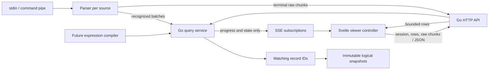

# Binary–frontend transport

## What changed

Streamline now has a versioned transport between the Go binary and Svelte
frontend. Go owns query execution, matching indexes, immutable result snapshots,
and session state. The browser sends commands and requests bounded row windows;
it never receives or retains the full result set.

The implementation adds:

- an in-memory query coordinator with atomic initial scans and live append support;
- JSON endpoints for session state, query commands, query recovery, parsed-row
  pagination, bounded raw stdin chunks, and resource release;
- an SSE endpoint for progress and state notifications;
- a Svelte viewer controller with intent/revision guards, follow and pause modes,
  atomic filter replacement, page-aligned viewport loading, and a 32 MB row-page cache;
- a segmented TanStack virtual table that keeps global row offsets as 64-bit values;
- shared JSON fixtures plus Go and frontend tests for the wire contract and
  concurrency-sensitive behavior.

The binary starts stdin ingestion alongside the HTTP server; the source manager
adds independent command captures on demand.
Recognized logs are appended in committed batches; unrecognized terminal input
is published as display-safe raw chunks at EOF or read failure. Field filters and general search execute server-side in input order. Normalization ownership
is documented in [Parser engine](parser.md).

## Architecture



`internal/query` contains transport-facing domain types and `Service`,
`Compiler`, and `Subscription` interfaces. `MemoryService` is session-scoped and
keeps captured records, matching-ID indexes, and snapshot descriptors in RAM.
`internal/httpapi` maps those interfaces to `/api/v1`. The binary injects the
service when it builds the HTTP handler.

The frontend separates concerns into wire types, an HTTP/SSE client, a bounded
LRU page cache, a pure state reducer, and `ViewerController`. `App.svelte` owns
source selection; its keyed `SourceViewer.svelte` owns the active controller. The virtual table renders only visible rows
and asks the controller for aligned pages around its overscanned viewport. See
[Frontend visual output](frontend.md) for the Svelte and pixel-level path.

## HTTP and SSE contract

All values that may exceed JavaScript's safe integer range use decimal strings.
Every displayable snapshot contains `sessionId`, `generationId`, `queryId`,
`revision`, `processedThrough`, `matchedCount`, and an opaque `snapshotToken`.
Every row has a stable decimal-string record ID.

| Endpoint | Behavior |
| --- | --- |
| `GET /api/v1/session` | Returns identity, input status, and `pending`, `records`, or `raw` input kind. |
| `GET /api/v1/input/raw` | Reads up to 16 immutable 64 KiB display-safe chunks for one generation. |
| `POST /api/v1/queries` | Validates a filter/sort command and returns `202` with initial query state. |
| `GET /api/v1/queries/{id}` | Returns authoritative state for reconnect or Resume. |
| `GET /api/v1/queries/{id}/rows` | Reads an `offset`/`limit` window from an exact snapshot token. |
| `GET /api/v1/queries/{id}/events` | Sends initial state, then progress, snapshot, input, and generation notifications. |
| `DELETE /api/v1/queries/{id}` | Cancels and releases query resources without deleting session records. |

Row requests default to 200 and reject limits above 1,000. Raw requests
default to four chunks and reject limits above sixteen. Errors use
`{"error":{"code":"…","message":"…"}}`; callers make decisions from the
stable code. SSE never carries records. The handler sends an authoritative
initial event, coalesces ordinary changes over 100 ms, keeps only the newest
queued event for a slow subscriber, sends 15-second heartbeats, and gives each
write a five-second deadline.

The raw endpoint requires `generation` and accepts decimal-string `offset` and
`limit` query parameters:

```text
GET /api/v1/input/raw?generation=1&offset=0&limit=4
```

It returns `{ generationId, offset, totalChunks, chunks }`; the three numeric
identifiers/counts are decimal strings. Chunks are immutable, UTF-8-safe, and
at most 64 KiB. Concatenating pages in offset order reconstructs the sanitized
display text without inserted separators. Stable validation/state codes are
`generation_required`, `generation_changed`, `raw_unavailable`,
`invalid_offset`, and `invalid_limit`.

## Consistency and lifecycle

The frontend reads session state before choosing its data path. Pending and
record input own an empty live query; a later raw input notification atomically
releases that query and starts generation-guarded sequential chunk loading.

Creating a query captures the current committed record boundary. The initial
scan runs against that prefix. Before publishing `ready`, it takes the append
lock, evaluates any records accepted during the scan, and publishes one complete
snapshot. This prevents a gap between historical scanning and live evaluation.

A snapshot token identifies a count within the append-only matching-ID index.
Later snapshots can extend that index without changing earlier prefixes, so
pagination through an older token remains stable. Queries are pinned while an
SSE subscriber is connected. Creation and disconnect start a 60-second grace
period; expiry or explicit deletion releases the query's result state.

The frontend increments an intent for each filter change. Superseded fetches are
aborted, and responses must still match the current intent, query, revision, and
snapshot token before they can update the display. Revision requests are ordered
so a late page from an older notification cannot replace a newer one. Failed
page loads can retry the same revision.

A filter change leaves the prior rows visible while the replacement query scans.
When the first complete page arrives, the reducer performs a single `replace`
transition and releases the old query. An invalid filter retains the prior view
and reconnects its stream.

Following uses the newest snapshot and loads its tail. Navigating to an older
window applies `pause`, pinning the displayed snapshot while Go continues
capture and query evaluation. Resume fetches authoritative query state, loads
its latest tail, and then reenables live updates. Full prefix pages are reusable
across append-only revisions; partial tail pages are refetched when the matching
count grows.

EventSource reconnects automatically, while the controller also uses the query
state endpoint to recover missed or coalesced notifications. If a following
query has expired, it is rebuilt. A paused view never silently jumps when its
snapshot is unavailable; it keeps cached rows and exposes an explicit refresh
state. A generation notification similarly starts a replacement query while the
old display remains visible.

## Extension rules

- The future query engine implements `query.Compiler`; the HTTP layer must not
  introduce a second filter syntax.
- Ingestion calls `MemoryService.Append` only with complete committed batches,
  `SetInputStatus` after parsed EOF/error, and `SetRawOutput` for terminal
  unrecognized input.
- New sort orders must state whether they are live append-only or fixed at query
  creation. Input order is currently the only accepted sort.
- Aggregates and record-detail endpoints should accept the same snapshot token
  so every part of the UI describes one revision.
- Future storage providers implement the query/storage contracts with the same
  stable logical IDs and snapshot behavior; browser-visible tokens stay opaque.
- Rows remain on bounded JSON endpoints. SSE remains a notification channel to
  preserve backpressure and reconnect behavior.

## Verification

`make check` runs Svelte diagnostics, frontend reducer/controller/cache tests,
Go tests, Go vet, and formatting checks. The Go suite covers append-during-scan,
stable old-snapshot pagination, compiler injection, notification coalescing,
query expiry, progressive stdin publication, raw chunk paging, HTTP validation,
structured errors, and initial SSE state. The frontend suite covers session-first
routing, raw transitions, atomic replacement, reversed query responses, pause
semantics, page prefetch and deduplication, stale viewport responses, segmented
bigint virtual offsets, partial-tail cache invalidation, and the shared 64-bit JSON fixture.
A production frontend build and standalone Go build verify the embedded path.

## General search command

See [General log search](search.md) for architecture, execution flow, and design choices.

`POST /api/v1/queries` accepts an optional `search` object alongside existing
`filter` and `sort`:

```json
{"filter":[],"sort":"input","search":{"text":"timeout\napi","mode":"plain","operator":"and"}}
```

`mode` is `plain` (default) or `regexp`; `operator` is `or` (default) or `and`.
Unknown values are rejected. Omitted or blank search imposes no additional
restriction. LF, CRLF, and CR delimit expressions. Whitespace-only lines are
ignored; significant whitespace and physical line numbers are preserved.
The existing 64 KiB request-body bound still applies.

All expressions compile before query creation. Invalid expressions return
HTTP 400 with `error.code: "invalid_search"`, a summary `message`, and
`lineErrors: [{"line": 3, "message": "..."}]` for every failing physical line
(one-based). Invalid mode/operator errors use the same code without line errors.
The HTTP client preserves these diagnostics for the editor. Failed submissions
leave previous results available and create no query.

Frontend query specifications retain search alongside filter and sort through
pending/displayed state, generation changes, reconnects, and expiration recovery.
Row, snapshot, and SSE shapes are unchanged; matched counts and pages already
reflect search, rather than filtering a fetched page in the browser.

## Independent command sources

Execution, cleanup, decisions, and debugging: [Command log sources](command-sources.md).

`internal/source` owns a registry with permanent `stdin` and independently retained
command captures. Each source owns a `MemoryService` with its own session/query
identities. Command IDs are unique across binary restarts. Existing unscoped
routes remain stdin aliases; the same session, raw, and query routes are available
beneath `/api/v1/sources/{id}`. Snapshot tokens and query IDs cannot be used in
another source's routes.

| Route (under `/api/v1`) | Contract |
| --- | --- |
| `GET /sources` | Ordered array of source descriptors, stdin first |
| `GET /sources/events` | Named `sources` SSE events containing the authoritative descriptor array; initial state on every connection, one-slot change queue, 15-second heartbeats |
| `POST /sources` | `{ "command": "...", "mode": "auto" }`; mode defaults to `auto`, also accepts `text`; returns `202` with a new source |
| `POST /sources/{id}/stop` | Idempotent Stop request; returns `204` before cleanup finishes |
| `DELETE /sources/{id}` | Stop and join the producer, then release source data and queries; returns `204` |

Descriptors expose `id`, `kind`, `command` (commands only), `mode`, `state`,
`createdAt`, optional `finishedAt`, `exitCode`, `error`, and the existing `session`
shape. Lifecycle is `starting → running → exited/failed`, or
`starting/running → stopping → stopped`. Exit code `-1` represents a signaled
process; startup failure has no exit code. `stopped` is intentional completion
and has input status `eof`. Failed commands retain output and report input status
`error`. Source lifecycle and query input state are finalized after output drains.

Source mutations require `Content-Type: application/json` and
`X-Streamline-Request: 1`. Stop/Delete accept an empty body or `{}`. Blank commands,
NUL bytes, unknown modes/fields, oversized requests, and mutations of stdin are
rejected. Unknown source IDs return `source_not_found` (404). All requests require
a loopback Host, and mutations require same-origin browser requests. Release
builds trust no additional origins; dev builds allow the explicit Vite origins.
No CORS permission is granted to unrelated websites.

The UI uses one source-list SSE connection and one active viewer controller
(which can briefly overlap query streams while applying filters). Switching
sources disposes query resources and retains only viewer preferences; returning
creates a fresh query and restores the selected result position. Log ingestion
is independent of all HTTP connections. Raw output uses the existing bounded
chunk API; SSE never carries log rows.
